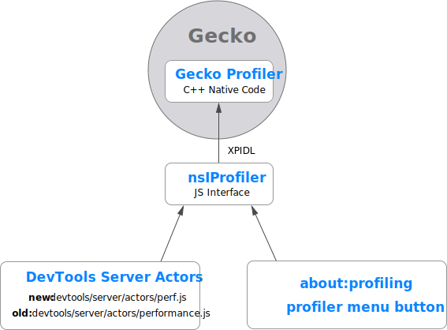
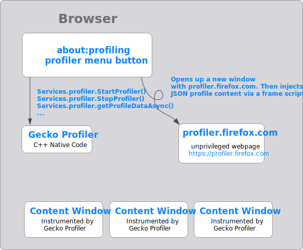
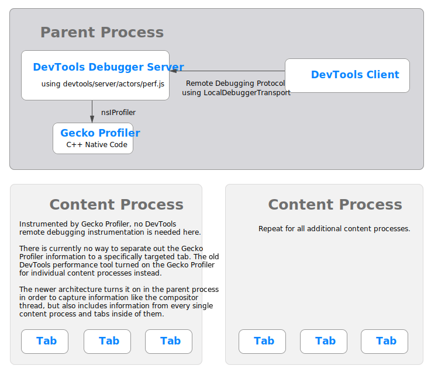

# Profiler Architecture

This document provides an overall look at the architecture of the profiler, and how all the various pieces fit together.

## Gecko Profiler

## Browser

## DevTools Recording Panel

Please note, this is the diagram for the new recording panel in DevTools that is off by default. This is the path forward for integrating [profiler.firefox.com](https://profiler.firefox.com) into DevTools. It can be enabled using `devtools.performance.new-panel-enabled`. There is no architecture doc for the current Firefox DevTools panel.

## Remote Profiling

Remote profiling with DevTools is very similar to the above diagram, but involves slightly different transport messaging mechanisms in order to target remote devices.

## about:profiling

Firefox can configure the Gecko Profiler using about:profiling as well as the menu button that can be enabled via the [profiler.firefox.com](https://profiler.firefox.com) homepage. These UIs interact directly with the nsIProfiler interfaces via `Services.profiler`. The [documentation for those components live in mozilla central](https://searchfox.org/mozilla-central/source/devtools/client/performance-new).
