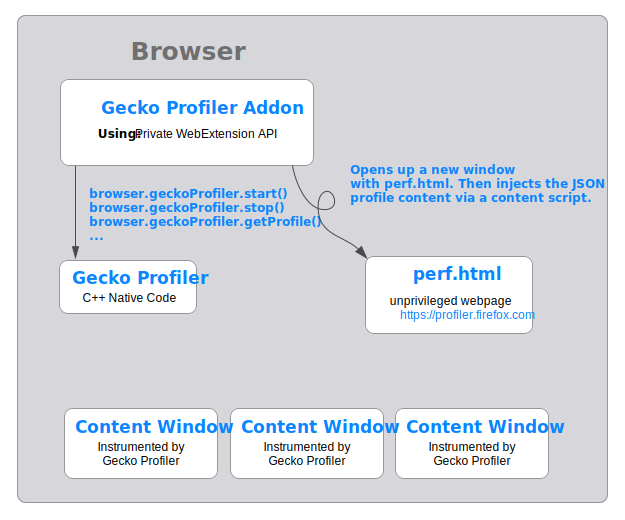
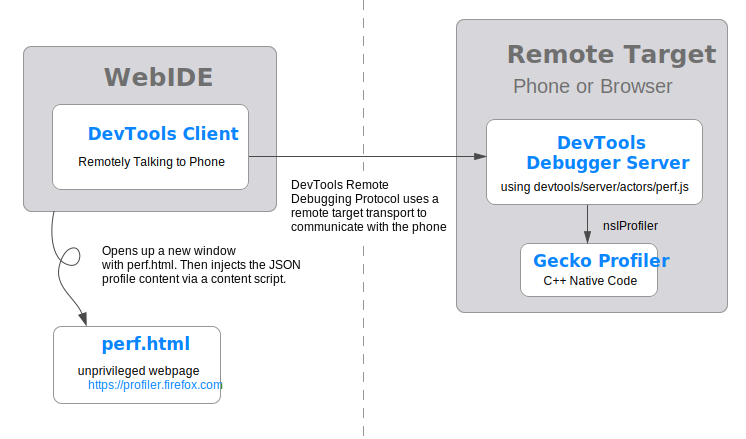

# Profiler Architecture

This document provides an overall look at the architecture of the profiler, and how all the various pieces fit together.

## Gecko Profiler

## Browser

## DevTools Recording Panel

Please note, this is the diagram for the new recording panel in DevTools that is off by default. This is the path forward for integrating perf.html into DevTools. It can be enabled using `devtools.performance.new-panel-enabled`. There is no architecture doc for the current Firefox DevTools panel.

## Remote Profiling

Remote profiling with DevTools is very similar to the above diagram, but involves slightly different transport messaging mechanisms in order to target remote devices.

