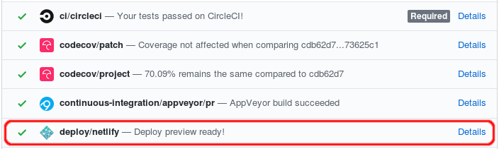

# Deploying to profiler.firefox.com

Our hosting service is [Netlify](https://www.netlify.com/). Deploying on a nginx instance is also possible, see below.

## Deploy to production

The `production` branch is configured to be automatically deployed to
<https://profiler.firefox.com>.

In addition to this pushes to the `main` branch deploys to the domain
https://main--perf-html.netlify.app. Every pull request will be deployed as well to a
separate domain, whose link will be added automatically to the PR:


## How to merge l10n into main

Our localization process happens inside [Pontoon](https://pontoon.mozilla.org/projects/firefox-profiler/).
Changes in Pontoon are being pushed into the `l10n` branch. They should be merged
into `main` before the deployment.

The easiest way is to
[create a pull request on GitHub](<https://github.com/firefox-devtools/profiler/compare/main...l10n?expand=1&title=🔃%20Sync:%20l10n%20-%3E%20main%20(DATE)>).
It would be nice to list down the locales that are changed in the PR description.
To be able to get the changed locales quickly, this command can be used
(assuming that `upstream` is the remote you use for this repository):

```
git fetch upstream && git diff --name-only upstream/main...upstream/l10n | awk -F '/' '{printf $2 ", "}'; echo
```

Be careful to always use the **create a merge commit** functionality, not
_squash_ or _rebase_, to keep a better history.

## How to deploy main to production

Before the deploy, changes in the [`l10n`](https://github.com/firefox-devtools/profiler/tree/l10n)
branch should be merged into `main` if there are any localization changes. See
the [section related to this step](#how-to-merge-l10n-into-main) for more details.

After merging the `l10n` branch, we can continue with the deployment.
The easiest by far is to
[create a pull request on GitHub](https://github.com/firefox-devtools/profiler/compare/production...main?expand=1).
It would be nice to write down the main changes in the PR description ([see below](#user-content-helpful-git-commands-to-write-the-main-changes)).

After the PR is created all checks should run. When it's ready the PR can be
merged. Be careful to always use the **create a merge commit** functionality,
not _squash_ or _rebase_, to keep a better history. Also you can copy the PR
description as the commit log body, so that the changelog is also present in the
git repository.

Once it's done the new version should be deployed automatically. You can follow the
process on [Netlify's dashboard](https://app.netlify.com/sites/perf-html/deploys)
if you have access.

### Helpful git commands to write the main changes

Here is how you can gather the changes since the last deploy:

1. Gather all the code changes:

```
git fetch upstream && git log upstream/production..upstream/main --first-parent --oneline --no-decorate --format="format:[%an] %s" --reverse
```

2. You'll probably need to adjust it manually: remove some useless commits (such
   as the dependency updates), fix some authors (as merge commits aren't always
   using the same author as the Pull Request author).
3. Gather the locales author changes:

```
git log upstream/production..upstream/main --grep '^Pontoon' --format="%(trailers:key=Co-authored-by,valueonly)" | awk NF | sed -E 's/([^<]*).*\(([a-z-]+)\)/\2: \1/i' | sort -h | uniq
```

## How to revert to a previous version

The easiest way is to reset the production branch to a previous version, and
force push it. You'll need to enable force-pushing for the branch production,
using the [Branch Settings on GitHub](https://github.com/firefox-devtools/profiler/settings/branches).

You can use the following script:

```
sh bin/revert-last-deployment.sh
```

When you're ready with a fix landed on `main`, you can push a new version to the
`production` branch as described in the first part.

## Mozilla internal contacts

You can find the Mozilla contacts about our deployment in [this Mozilla-only
document](https://docs.google.com/document/d/16YRafdIbk4aFgu4EZjMEjX4F6jIcUJQsazW9AORNvfY/edit).

# Deploying on a nginx instance

To deploy on nginx (without support for direct upload from the Firefox UI), run `yarn build-prod`
and point nginx at the `dist` directory, which needs to be at the root of the webserver. Additionally,
a `error_page 404 =200 /index.html;` directive needs to be added so that unknown URLs respond with index.html.
For a more production-ready configuration, have a look at the netlify [`_headers`](/res/_headers) file.

# Publishing profiler-cli to npm

The [`@firefox-devtools/profiler-cli`](https://www.npmjs.com/package/@firefox-devtools/profiler-cli)
package is published to npm from this repository. It provides a command-line
interface for querying Firefox Profiler profiles — see
[`profiler-cli/README.md`](../profiler-cli/README.md) for usage.

## Prerequisites

- Be logged in to npm (`npm login`) with publish access to the `@firefox-devtools` scope.
- Make sure the working tree is clean and you are on the commit you want to publish.
- Run `yarn test-all` (or at least `yarn test-cli`) to confirm the CLI still builds and passes tests.

## Bump the version

Edit the `version` field in [`profiler-cli/package.json`](../profiler-cli/package.json),
then land the version bump on `main` before publishing.

## Publish

From the repository root:

```
yarn publish-profiler-cli
```

[`scripts/publish-profiler-cli.mjs`](../scripts/publish-profiler-cli.mjs) will:

1. Run `yarn build-profiler-cli` to produce `profiler-cli/dist/profiler-cli.js` (a
   single self-contained bundle with no runtime dependencies).
2. Run `npm publish profiler-cli/`, picking `--tag next` when the version
   contains `-` (e.g. `0.1.0-next.1`) and `--tag latest` otherwise.
3. Trigger the `prepublishOnly` hook in `profiler-cli/package.json`, which runs
   [`scripts/verify-profiler-cli-build.mjs`](../scripts/verify-profiler-cli-build.mjs)
   to confirm the bundle exists and embeds the current `package.json` version —
   this guards against publishing a stale build.

Extra arguments are forwarded to `npm publish`. For example:

```
# Build and verify, but do not actually publish.
yarn publish-profiler-cli --dry-run

# Override the automatic dist-tag.
yarn publish-profiler-cli --tag alpha
```

## Verify the release

After publishing, confirm the new version is listed on
[npm](https://www.npmjs.com/package/@firefox-devtools/profiler-cli) and installs
cleanly:

```
npm install -g @firefox-devtools/profiler-cli@latest
profiler-cli --version
```
