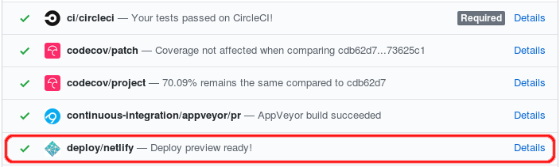

# Deploying to profiler.firefox.com

Our hosting service is [Netlify](https://www.netlify.com/). Deploying on a nginx instance is also possible, see below.

## Branches and automatic deploys

The `production` branch is configured to be automatically deployed to
<https://profiler.firefox.com>.

In addition to this pushes to the `main` branch deploys to the domain
https://main--perf-html.netlify.app. Every pull request will be deployed as well to a
separate domain, whose link will be added automatically to the PR:


## The release, step by step

A release happens in this order. The first two steps land on `main` **before**
the deploy, the last two happen **after** the web version is live:

1. [Merge l10n into main](#1-merge-l10n-into-main), if there are localization changes.
2. [Bump the profiler-cli version](#2-bump-the-profiler-cli-version).
3. [Deploy main to production](#3-deploy-main-to-production).
4. [Publish profiler-cli to npm](#4-publish-profiler-cli-to-npm).
5. [Tag the CLI release and create the GitHub release page](#5-tag-the-cli-release-and-create-the-github-release-page).

Steps 2, 4 and 5 are only about the command-line interface. You can skip all
three when nothing in this deploy affects the CLI. Be careful though: the CLI
includes source from the main `src/` directory, like `profile-logic`, so a
change outside `profiler-cli/` can still affect it. Processed or Gecko profile
format version bumps, for example, only reach CLI users through a new release.
When in doubt, publish. We are not running out of version numbers.

The first four steps can be run interactively with:

```
yarn deploy-prod-e2e
```

The script checks the local environment, creates the l10n and CLI version pull
requests, waits for their reviews and checks, creates the production pull
request with generated release notes, and publishes the CLI after production is
merged and you confirm that the Netlify deployment is live. It asks for
confirmation before every commit, push, pull request change, merge, and npm
publication. Enter the current CLI version at the version prompt to skip the
version-bump pull request when resuming an interrupted deployment. Step 5 still
needs to be completed manually.

## 1. Merge l10n into main

Our localization process happens inside [Pontoon](https://pontoon.mozilla.org/projects/firefox-profiler/).
Changes in Pontoon are being pushed into the `l10n` branch. They should be merged
into `main` before the deployment.

The easiest way is to
[create a pull request on GitHub](<https://github.com/firefox-devtools/profiler/compare/main...l10n?expand=1&title=🔃%20Sync:%20l10n%20-%3E%20main%20(DATE)>).
It would be nice to list down the locales that are changed in the PR description.
To be able to get the changed locales quickly, this command can be used
(assuming that `upstream` is the remote you use for this repository):

```
git fetch upstream && git diff --name-only upstream/main...upstream/l10n | awk -F '/' '{printf $2 ", "}'; echo
```

Be careful to always use the **create a merge commit** functionality, not
_squash_ or _rebase_, to keep a better history.

## 2. Bump the profiler-cli version

Like the localization changes, the version bump for the
[`profiler-cli`](../profiler-cli/README.md) package lands on `main` before the
deploy, so that the deployed `production` branch already contains the version
that will be published to npm.

Edit the `version` field in [`profiler-cli/package.json`](../profiler-cli/package.json)
and land it as its own pull request, titled
`Bump profiler-cli version to <VERSION>`. Nothing gets published at this point:
that happens in [step 4](#4-publish-profiler-cli-to-npm), once the web version is
deployed.

## 3. Deploy main to production

Make sure [step 1](#1-merge-l10n-into-main) and [step 2](#2-bump-the-profiler-cli-version)
are landed on `main` first. Then, the easiest by far is to
[create a pull request on GitHub](https://github.com/firefox-devtools/profiler/compare/production...main?expand=1).
It would be nice to write down the main changes in the PR description ([see below](#user-content-helpful-git-commands-to-write-the-main-changes)).

After the PR is created all checks should run. When it's ready the PR can be
merged. Be careful to always use the **create a merge commit** functionality,
not _squash_ or _rebase_, to keep a better history. Also you can copy the PR
description as the commit log body, so that the changelog is also present in the
git repository.

Once it's done the new version should be deployed automatically. You can follow the
process on [Netlify's dashboard](https://app.netlify.com/sites/perf-html/deploys)
if you have access.

### Helpful git commands to write the main changes

Here is how you can gather the changes since the last deploy:

1. Gather all the code changes:

```
git fetch upstream && git log upstream/production..upstream/main --first-parent --oneline --no-decorate --format="format:[%an] %s" --reverse
```

2. You'll probably need to adjust it manually: remove some useless commits (such
   as the dependency updates), fix some authors (as merge commits aren't always
   using the same author as the Pull Request author).
3. Gather the locales author changes:

```
git log upstream/production..upstream/main --grep '^Pontoon' --format="%(trailers:key=Co-authored-by,valueonly)" | awk NF | sed -E 's/([^<]*).*\(([a-z-]+)\)/\2: \1/i' | sort -h | uniq
```

## 4. Publish profiler-cli to npm

The [`@firefox-devtools/profiler-cli`](https://www.npmjs.com/package/@firefox-devtools/profiler-cli)
package is published to npm from this repository. It provides a command-line
interface for querying Firefox Profiler profiles, see
[`profiler-cli/README.md`](../profiler-cli/README.md) for usage.

### Prerequisites

- The [version bump](#2-bump-the-profiler-cli-version) is landed and the web
  version is [already deployed](#3-deploy-main-to-production).
- Have an npm account with publish access to the `@firefox-devtools` scope. The
  publish script runs `npm login` for you if you are not logged in already.
- Be on the commit you want to publish. The publish script refuses to run on a
  dirty working copy, so commit or stash everything first.
- Run `yarn test-all` (or at least `yarn test-cli`) to confirm the CLI still builds and passes tests.

### Publish

From the repository root:

```
yarn publish-cli
```

[`scripts/publish-profiler-cli.mjs`](../scripts/publish-profiler-cli.mjs) will:

1. Check that the working copy is clean with `git status --porcelain`, and refuse
   to publish otherwise. `yarn build-cli` below bundles the working copy rather
   than a commit, so uncommitted changes would end up on npm with no commit or
   tag matching them.
2. Run `npm login` if `npm whoami` says you are not logged in, so the
   interactive part happens before the long test run rather than after it. This
   is skipped for `--dry-run`, which uploads nothing and needs no credentials.
3. Run `yarn test-all`.
4. Run `yarn build-cli` to produce `profiler-cli/dist/profiler-cli.js` (a
   single self-contained bundle with no runtime dependencies).
5. Run `npm publish profiler-cli/`, picking `--tag next` when the version
   contains `-` (e.g. `0.1.0-next.1`) and `--tag latest` otherwise. npm asks for
   a second browser authentication here, for the 2FA check on the upload
   itself. Being logged in does not replace it.
6. Trigger the `prepublishOnly` hook in `profiler-cli/package.json`, which runs
   [`scripts/verify-profiler-cli-build.mjs`](../scripts/verify-profiler-cli-build.mjs)
   to confirm the bundle exists and embeds the current `package.json` version,
   this guards against publishing a stale build.

Extra arguments are forwarded to `npm publish`. For example:

```
# Build and verify, but do not actually publish.
yarn publish-cli --dry-run

# Override the automatic dist-tag.
yarn publish-cli --tag alpha
```

### Verify the release

After publishing, confirm the new version is listed on
[npm](https://www.npmjs.com/package/@firefox-devtools/profiler-cli) and installs
cleanly:

```
npm install -g @firefox-devtools/profiler-cli@latest
profiler-cli --version
```

## 5. Tag the CLI release and create the GitHub release page

Once the package is on npm, tag the release and publish the release notes. Tags
follow the `profiler-cli-v<VERSION>` naming scheme and point at the
`Bump profiler-cli version to <VERSION>` commit from
[step 2](#2-bump-the-profiler-cli-version):

```
git fetch upstream
git tag profiler-cli-v0.8.0 <BUMP_COMMIT_SHA>
git push upstream profiler-cli-v0.8.0
```

Then create the [release page](https://github.com/firefox-devtools/profiler/releases)
for that tag. The GitHub CLI can generate the changelog from the commits since
the previous tag:

```
gh release create profiler-cli-v0.8.0 --title profiler-cli-v0.8.0 --generate-notes --latest
```

The generated notes need some editing afterwards: add a **Highlights** section
describing the notable new commands or behaviour changes, remove the noisy
commits, and link to the deploy announcement for this deploy on
[Discourse](https://discourse.mozilla.org/c/firefox-tooling-announcements/521).
Have a look at a [previous release](https://github.com/firefox-devtools/profiler/releases/tag/profiler-cli-v0.8.0)
for the expected shape.

## How to revert to a previous version

The easiest way is to reset the production branch to a previous version, and
force push it. You'll need to enable force-pushing for the branch production,
using the [Branch Settings on GitHub](https://github.com/firefox-devtools/profiler/settings/branches).

You can use the following script:

```
sh bin/revert-last-deployment.sh
```

When you're ready with a fix landed on `main`, you can push a new version to the
`production` branch as described in the first part.

## Mozilla internal contacts

You can find the Mozilla contacts about our deployment in [this Mozilla-only
document](https://docs.google.com/document/d/16YRafdIbk4aFgu4EZjMEjX4F6jIcUJQsazW9AORNvfY/edit).

# Deploying on a nginx instance

To deploy on nginx (without support for direct upload from the Firefox UI), run `yarn build-prod`
and point nginx at the `dist` directory, which needs to be at the root of the webserver. Additionally,
a `error_page 404 =200 /index.html;` directive needs to be added so that unknown URLs respond with index.html.
For a more production-ready configuration, have a look at the netlify [`_headers`](/res/_headers) file.
