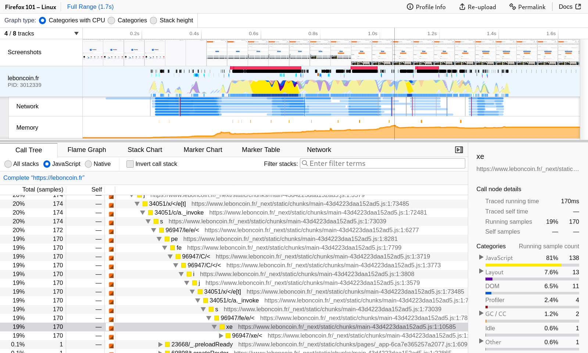

# User Guide

Capture a performance profile. Analyze it. Share it. Make the web faster.

Welcome to the user docs for [profiler.firefox.com](https://profiler.firefox.com). This web app is the official Firefox Profiler for analyzing performance profiles of Firefox and the Gecko browser engine. Visit [profiler.firefox.com](https://profiler.firefox.com), and follow the instructions to get started profiling. This guide has various documents and videos demonstrating how to get started profiling. 

Even more profiler resources:
- 💪 Looking to contribute? Check out [our Github project!](https://github.com/firefox-devtools/profiler)
- 🔎 Interested in learning how the profiler frontend works? Take a look at our [developer docs!](https://github.com/firefox-devtools/profiler/tree/main/docs-developer)
- ⚙️ Want to understand the C++ Gecko Profiler backend? Check out the [Firefox source docs](https://firefox-source-docs.mozilla.org/tools/profiler/index.html) or the [source itself!](https://searchfox.org/mozilla-central/source/tools/profiler)
- 💬 Feedback or ideas? Let us know in our [Github discussions!](https://github.com/firefox-devtools/profiler/discussions)
- 👋 Can't find what you need? Got a complicated question or profile? Come and chat to us in the [*Firefox Profiler* room on Matrix.](https://chat.mozilla.org/#/room/#profiler:mozilla.org)
