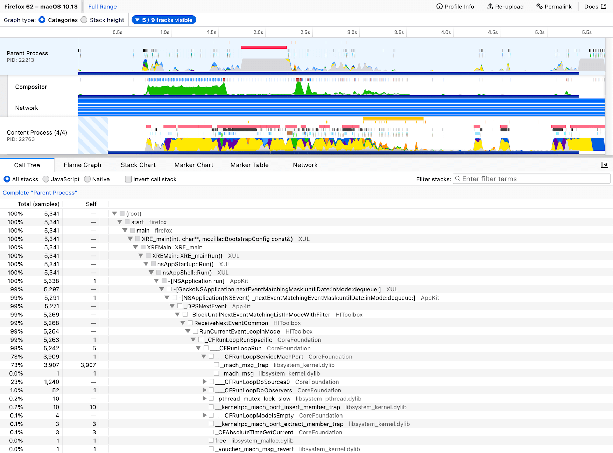

# User Guide

Capture a performance profile. Analyze it. Share it. Make the web faster.

Welcome to the user docs for [profiler.firefox.com](https://profiler.firefox.com). This web app is the official Firefox Profiler for analyzing performance profiles of Firefox and the Gecko browser engine. Visit [profiler.firefox.com](https://profiler.firefox.com), and follow the instructions to get started profiling. This guide has various documents and videos demonstrating how to get started profiling. Looking to contribute? Check out [github.com/firefox-devtools/profiler](https://github.com/firefox-devtools/profiler).
