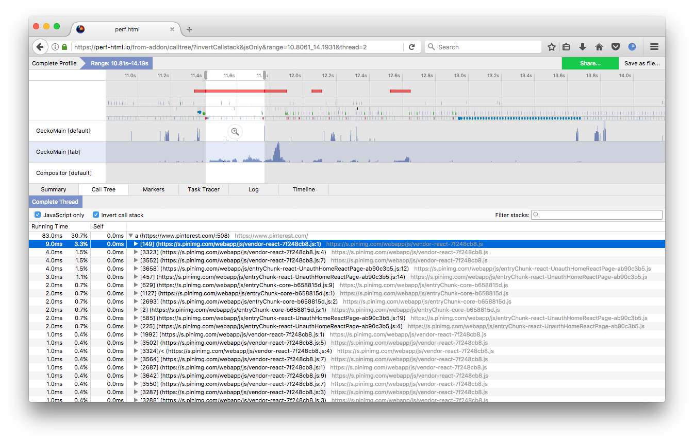

# User Guide

Capture a performance profile. Analyze it. Share it. Make the web faster.

Welcome to the user docs for [perf.html](https://profiler.firefox.com), a web app that analyzes profiles from Firefox. [Visit the web app](https://profiler.firefox.com), and follow the instructions to get started profiling. This guide has various documents and videos demonstrating how to get started profiling. Looking to contribute? Check out [github.com/devtools-html/perf.html](https://github.com/devtools-html/perf.html).
