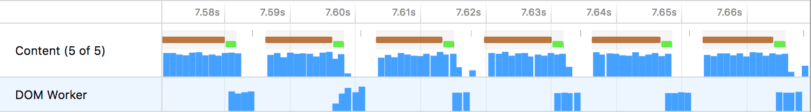
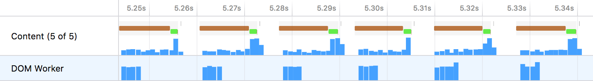
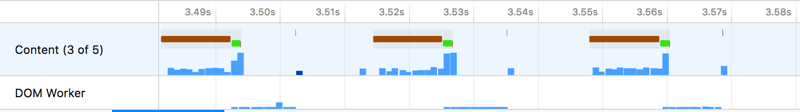
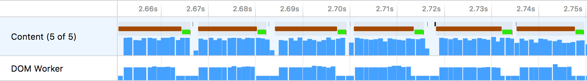

# Case Study
## Harnessing parallelism

Consider the [previous case study](bunny.md). The amount of work being done was reduced by some performance fixes, allowing for a much faster frame rate. However, there is still a problem with this code. It's not taking advantage of the parallelism of having a worker thread.

Consider the optimized profile from the previous case study: [https://perfht.ml/2IqQTH2](https://perfht.ml/2IqQTH2)



Looking at a zoomed-in view of the thread stack graph shows how the content process' main thread is drawing the visualization to the screen, then asking the worker for the next draw calls. This effectively makes the two threads synchronous as they block each other taking turns doing the work. The blank spots in the content thread (which contain idle stacks) represent time where the content thread is blocked as it waits for the worker to complete its work.

## The code

In a simplified code example, the iframe that is drawing using the [`CanvasRenderingContext2D`](https://developer.mozilla.org/en-US/docs/Web/API/CanvasRenderingContext2D API) runs code that looks something like this:

```js
worker.addEventListener('message', message => {
  if (message.data.type === 'draw') {
    requestAnimationFrame(() => {
      // Draw the current set of rectangles.
      drawRects(message.data.drawCalls);
      // Post a message to the worker asking for the next draw calls.
      worker.postMessage({ type: 'generate-draw-calls' });
    });
  }
});
```

In this example, the iframe draws to the canvas, and once it's done, it posts a message to the worker asking it to generate a new list of the draw calls. While this works, it's not harnessing the fact that the worker can run code in parallel. The fix luckily is simple. Swap the order of the `drawRect` and `worker.postMessage` calls.

```js
worker.addEventListener('message', message => {
  if (message.data.type === 'draw') {
    requestAnimationFrame(() => {
      // Ask the worker to generate the new draw calls for the NEXT frame.
      worker.postMessage({ type: 'generate-draw-calls' });
      // Draw the current frame.
      drawRects(message.data.drawCalls);
    });
  }
});
```

## The new profile

Profiling this change reveals the new behavior: https://perfht.ml/2IpSRr4



Now the content process' main thread is not blocked by the worker. The overall time to draw a single frame is the same, but conceptually this has an important difference. The blank spots in the content thread no longer represent time where it is blocked. Now it truly represents idle time, where no work needs to be done.

## How this improves performance

Consider what happens if the worker takes a long time to compute the new draw calls. As the work scales, it happens in parallel. To simulate this, a function called `doWork` can be added to the worker.

## Busy synchronous threads

This is a profile of what this looks like for a synchronous ordering: https://perfht.ml/2wuFSj1



The worker takes long enough that the frames start to skip between each rendering. The result is that both threads and up with lots of idle time, and the end-user perceives that the performance is slower.

## Busy parallel threads

This is a profile for parallel processing: https://perfht.ml/2KajgWV



Here there are a lot more frames being drawn. The end-user will perceive a more fluid animation, and the experience will feel much faster. This performance boost perceived by the end user means that in fact, the threads are each doing more work. The work is evenly distributed between the two threads and they do spend time idle by being blocked.

## In summary

Code can be optimized to do less work and this can be great for being able to have smoother running code and a longer battery life. Another class of optimizations is better parallelism. Making code non-blocking means that more work can be performed at the same time and the results can be presented to the user.

The main trade-off with greater parallelism is that more power can be consumed when threads do not remain idle. In the above example, a greater frame-rate was achieved by parallelizing the tasks, but more work was in fact being done by the smoother-running parallel code.

This type of optimization has lots of relevance when working on large multi-threaded applications. While synchronous IPC (inter-process communication) can cause code to become blocked while waiting for a response, asynchronous communication can also cause code to be blocked from executing. It's important to profile to verify the assumptions of how tasks will be scheduled in real-world code.
