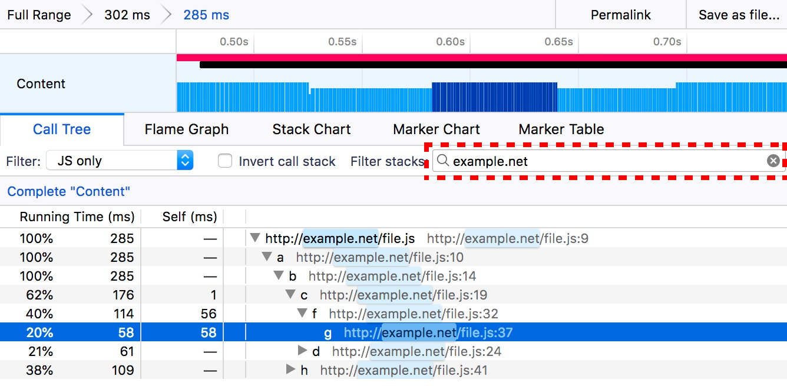
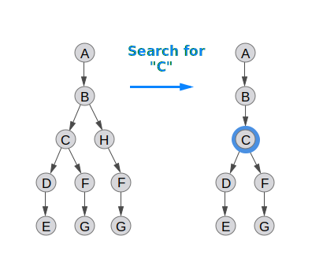
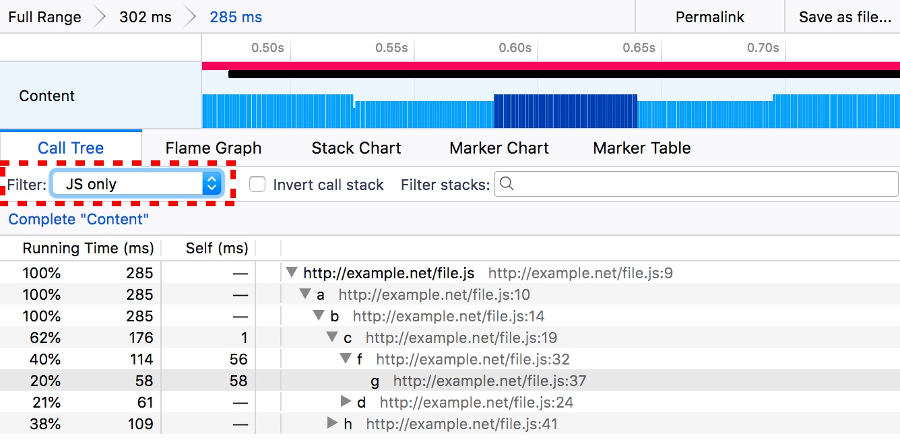
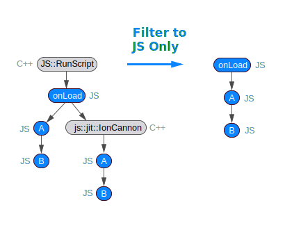
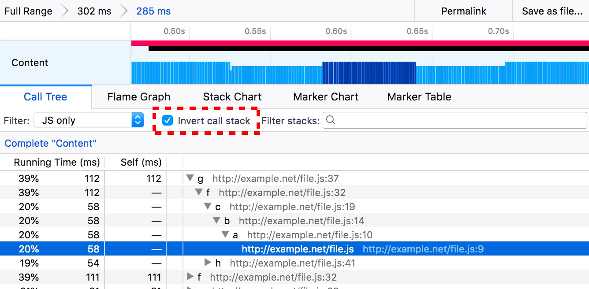

# Filtering call trees

Call trees can grow to be quite large, especially when profiling a browser engine. Typically, only portions of the tree are actually useful for any given analysis. perf.html provides a variety of tools for filtering and transforming a tree in order to only show the relevant parts. It's important when filtering to know the difference between filtering out samples and transforming stacks. When removing samples, the tree will essentially be the same shape, but may be missing certain branches that were only present in certain samples. When transforming the tree, the shape of the sample's stacks will be modified. Samples will only be dropped if their stacks are completely removed during the transformation operation.

The following are the different types of filtering operations that are supported.

| Filter type | Description |
| ----------- | ----------- |
| Search filter | Drop samples that do not match a text string. |
| Implementation filter | Restrict stacks to an implementation—native (C++) stacks, or to JavaScript stacks. |
| Invert call stack | Flip the sample's stacks upside down and build a new call tree. |
| Transforms | Modify the shape of the call tree according to some operation. Typically, this only modifies the stacks. |

## Search filter

Searching will exclude samples that do not match a search string. The search filter looks at every function in the sample's stack. If the function's name, resource, or URL match, then the sample will be retained; otherwise, it will be filtered out. Multiple search terms can be added, as long as they are separated by commas.

The above diagram is reproduced in the profile below:

* Before searching: [https://perfht.ml/2I3SMsR](https://perfht.ml/2I3SMsR)
* After searching: [https://perfht.ml/2rbcj0N](https://perfht.ml/2rbcj0N)

The following are some ideas on how to use search terms:

 * `js::` - Filter for a C++ namespace.
 * `www.example.com` - Filter for a domain name.
 * `www.example.com/assets/scripts.js` - Filter for a single script.

## Implementation filter

The implementation filter is useful for narrowing down the call tree to a subset of stack types. For instance, it can be useful to only show native stacks (C++ and Rust) or to only show JavaScript stacks.

The following graphic demonstrates how it can be useful to filter to only JavaScript stacks.

Before the implementation filter, the call tree contains both C++ JavaScript internals, as well as the JavaScript stacks. This interleaving could be useful when diagnosing how the JS engine is optimizing code, but for normal JS performance, profiling this could be confusing to find hot JS functions. When the native stacks are removed, the call tree that is generated is much more sensible for representing the execution of JavaScript code.

The implementation filter will modify the shape of stacks and generate a completely new call tree. If any of the filtered stacks in a sample are empty (for instance filtering on JavaScript when there are only C++ stacks), then those samples with empty stacks will be dropped from the analysis.

## Invert call stack

Inverting the call stacks of samples will produce an entirely new call tree. All of the self time will be at the roots of the call tree. The implications to the shape of the call tree may be surprising, but consider the following graphics.

In this profile, for the sake of brevity, there are only 3 samples that were collected 1ms apart. In most uninverted call trees, there is only one root node. In this case, `A` calls `B` and it's not until the third stack frames where the calls diverge to function `X` and function `C`. The call tree on the right is what is produced from these samples. Now consider inverting all of the stacks in the samples.

Previously, the stacks `X -> Y -> Z` were each at different levels. However, in the inverted view, the stacks are now at the same level. When the call tree is created from these samples, there are now two different roots, starting from the function `Z` and the function `E`. The inversion made the `Z -> Y -> X` portions of the stacks fall into the same level.

Inversion is most useful in surfacing the functions where time is actually being spent. The trees are typically much larger and noisier than uninverted call trees.

## Transforms

Call tree transforms provide a finer grain control over how to modify the call tree. They modify the stack in different operations. They can operate at individual call nodes on the tree, or across the entire tree for a given function. Different programs use different terms to describe these operations, but perf.html has defined certain operations.

### Merge

Merging takes a call node and removes it from the call tree. Any self time for that node is then charged to its parent node. This can be done for a single call node, or for all functions in the tree. This type of operation can be useful for modifying the shape of the tree and removing unhelpful functions from the call tree.

### Focus

Focusing on a function or call node removes all of the ancestor call nodes—the children call nodes remain. If a stack does not contain that function or node, then it is removed. This effectively focuses on a subtree or a set of subtrees on the call tree.

### Collapse

Collapsing functions is an operation that takes multiple call nodes and combines them all together into a new single call node. This can be done for an entire subtree, in order to reduce the amount of nodes in the tree. This can also be done for contiguous call nodes. For example, it can be useful to collapse functions that are all part of some library or call nodes that are recursing.

### Drop

Dropping is used to mean removing samples, but not changing any properties of the stacks. This could be useful for dropping functions that are prevalent like idle functions, but that gets in the way of analysis.
