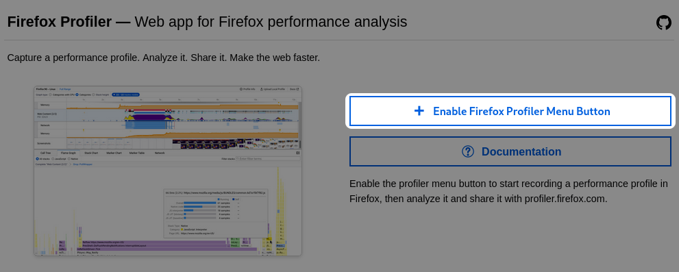
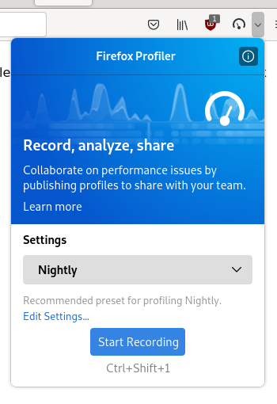
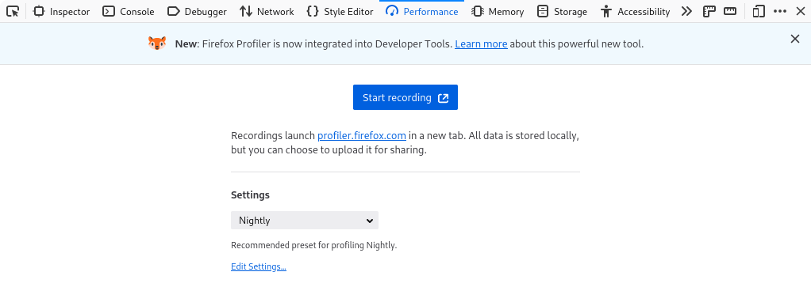
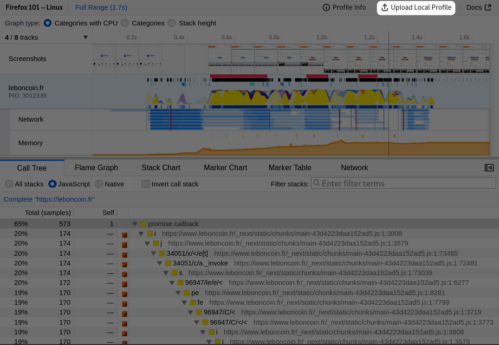
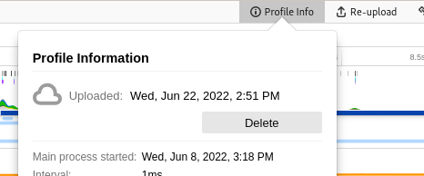
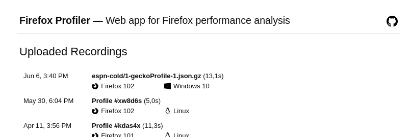
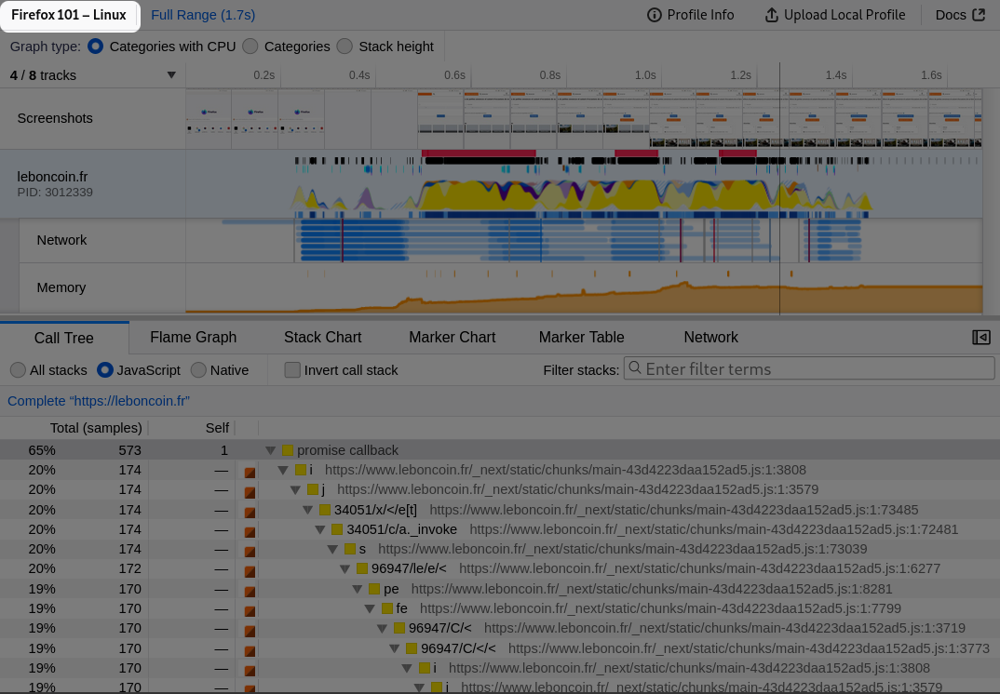

# Getting Started

This page is an overview of the general process of capturing a profile.

## Access the Firefox Profiler controls

The Firefox Profiler can be used with 2 entry points: either from the popup, or
from the devtools panel.

?> We recommend using the popup so that the overhead
caused by the other devtools is avoided.

### Enable the popup

The simplest way to enable the popup is going to https://profiler.firefox.com
and clicking the big button `Enable Firefox Profiler Menu Button` in the page.

You can also drag and drop the icon from the toolbar customization
interface.

### Open the popup

You open the popup by clicking the small arrow on the side of the profiler icon.

There you can change the preset as well as access the advanced settings.

?> We
suggest using the preset `Firefox` (also called `Nightly` if running in the
nightly version of Firefox) if you want to profile the full browser (for
example to [report a performance problem in Firefox](https://firefox-source-docs.mozilla.org/performance/reporting_a_performance_problem.html)),
and `Web Developer` if you want to profile a web site.

### Using the Devtools panel

The same settings are available in the devtools panel.

!> As explained above, when opening the Devtools toolbox there's an
overhead, due to additional open panels. We try to maintain a minimal overhead,
but you need to keep this into account when looking at profiles that were
captured from this panel.

## Capture a profile

### Using the popup or the devtools panel

[A video showing how to use the profiler popup](images/getting-started-use-popup.webm ':include :type=video controls')

You can use the popup from the icon, or similarly the devtools panel, by
clicking on `Start Recording`, then `Capture`. Then the profiler user interface
will open to show the captured data.

Note that the profiler user interface is an external web page, however it's
cached locally the first time you access it. This means you'll need a network
connection to download it the first time you use it. If you have a network
connection in later uses and a new version is available, the UI will offer to
switch to the new version.

It's also important to know that the data stays local to your computer until you
upload it (see below).

### Using the profiler button

It's possible to click on the button to start the profiler with current
settings. Then click it again to capture the profile and the open the profiler
UI.

[A video showing how to use the profiler icon](images/getting-started-use-icon.webm ':include :type=video controls')

### Using keyboard shortcuts

The following keyboard shortcuts are available:

- `Ctrl + Shift + 1`: start the profiler, or stop and discard the data if it's already running.
- `Ctrl + Shift + 2`: capture the profile from the currently running session. It
  has no effect if the profiler isn't running.

## Share a profile

One of the most powerful and useful features of the Firefox Profiler is the ability to upload and share profiles. The first step is to hit the _Upload Local Profile_ button. You'll be able to exclude some information before uploading. Then the profile will be uploaded to an online storage. This profile can then be shared in online chat, emails, and bug reports. Note that anybody that has the link will be able to access the uploaded data, as it's not protected otherwise.

The current view and all of the filters applied to the profile will be encoded into the URL. After initially sharing the profile, a _Permalink_ button will be added, that can then be used to provide a handy shortened URL to the current view.

[A video showing how to upload a profile and how to get the permalink](images/getting-started-upload-permalink.webm ':include :type=video controls')

?> Profiles can also be saved to file, although the current view into the UI will not be saved. The file can be reloaded through the [profiler.firefox.com](https://profiler.firefox.com) interface by either drag and drop, or the file upload interface.

## Delete an uploaded profile

After uploading a profile, you can delete it from the `Profile info` panel.

You can also go to the [Uploaded Recordings page](/uploaded-recordings/ ':ignore') to list
all profiles you uploaded and delete them. Note that this list is only stored
locally in your Firefox, and for this reason you can delete only profiles that
you uploaded from the same browser instance.

## Name a profile

It's possible to name a profile so that it's conveniently findable later by
searching in the address bar. The name is part of the URL you'll share to others,
but otherwise isn't stored in the profile data.
