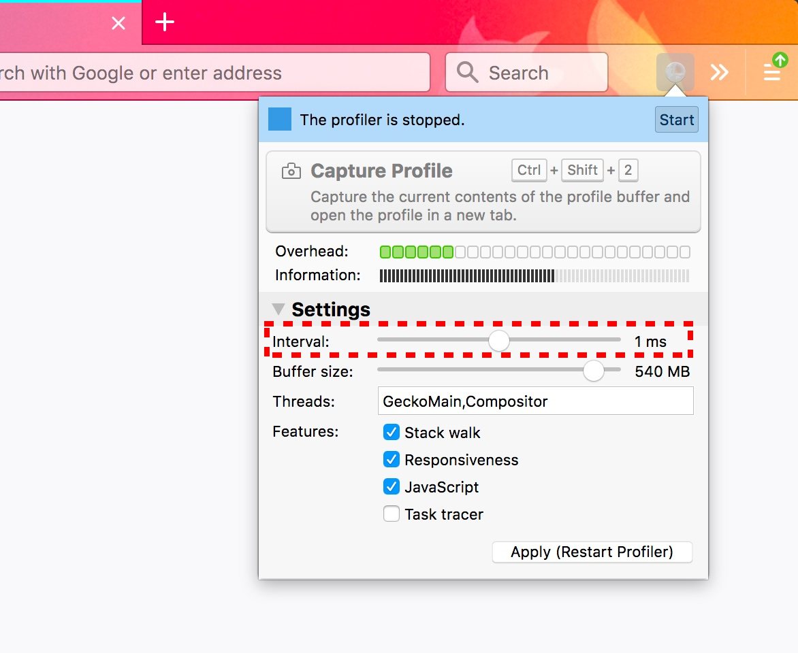

# Profiler Fundamentals

When profiling code, there are two primary sources of information—stack: samples and markers.

## Samples

For samples, the profiler stops the execution of the profiled code at a fixed rate, for example, every 1ms and records relevant information like the current stack. These samples are aggregated together and provide a statistical look into the execution of the program. There is no guarantee that all of the code that is running will be sampled, but with enough samples, it provides a good look into where time was spent while running the targeted code.

### Statistical significance and the overhead of samples

There are two ways to get more samples to provide more statistical significance. The first way is to increase the sampling rate. The sampling rate can be changed by tweaking the interval in the Gecko Profiler Addon.

For example, the sampling rate could be increased by changing the interval from 1ms to 0.1ms to collect 10 times more samples. This makes it easy to run the profiled program fewer times, but comes with a trade-off. When the profiler is collecting more samples, the profiler needs to do more work to collect these samples and thus, there is more overhead from the profiler. This can skew the results by measuring more of the overhead of profiling, compared to the actual program that is being run.

The other way to increase the number of samples is to run the code more often and not increase the sampling rate. For instance, to profile a mouse click event, one click event would not be sampled much with a frequency of 1ms. However, performing the click event multiple times over the course of a minute would increase the amount of samples collected, without introducing additional overhead from the profiler.

## Markers

Samples provide a view into the profiled program that is based on probability. Over time, with enough samples, the analysis will most likely contain samples of the code that was run. However, it can miss important events that happen quickly.

Markers provide a view into the executing code that does not miss anything. Markers are small pieces of data that are collected every time a specific event happens. For instance, when clicking the mouse, the C++ implementation could call a function that collects the current mouse coordinates and timestamp of the event. This information would then be stored in the profiler's buffer. This mouse click could happen very quickly and most likely it would be missed by the profiler if not for the marker.

Samples are a general-purpose solution to understand what is going on in the code, while markers provide a specific opinionated view. A very fast mouse event will have a high probability of being missed on a low sampling rate, but will always be collected as a marker. The problem with markers is that they must be hand-instrumented in the code and kept up to date. They are a great way for engineers with domain-specific information to surface more information about how a program is executing. The marker information can be cross-referenced with the samples to provide a better understanding of what code is doing.

Markers can be used for stack-like purposes as well. For instance, when working with React or any front-end component system, the JavaScript stacks will all be framework internals. The internals are resolving work requested by the components, but they do not directly map to the code that the component author wrote. To get around this, components could emit markers with start and end timestamps for when they are updated. These markers can then be turned into a chart that shows how components are rendering according to a hierarchy and how much time is being spent updating them. This labeled information can then be cross referenced with the statistically collected samples.

### Overhead and trade-offs with markers

While markers can provide very detailed information about a given system, they do come with some trade-offs. Unlike samples which are a generalized solution, each type of marker must be written and maintained as lines of code in the source. This requires a domain-expert's time and bandwidth to create. In addition, if this information is not correctly maintained, it could potentially be out of date and provide faulty information.

The process of collecting samples has an easy knob to tune the overhead—the sample rate. Markers will be collected every time an event happens. This is really nice for interesting parts of the profiled program, but can start to fall apart if overused. For instance, if every single part of the JavaScript engine was instrumented to collect a marker for how it executed, this would quickly turn into gigabytes of memory that would be slow to process, difficult to store and probably skew the results with a large amount of overhead.
