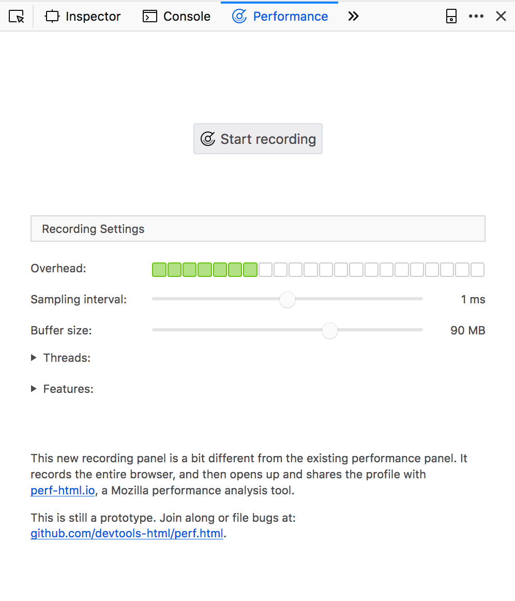

# Remote profiling on Android

You can use perf.html to investigate performance issues on Android, not just Windows, macOS and Linux.

## Pick your target

TL;DR: You probably want to profile [a "GeckoView example" nightly](https://tools.taskcluster.net/index/gecko.v2.mozilla-central.nightly.latest.mobile/android-api-16-opt). Read on for more details, or skip to the next section if you already know exactly which browser you want to profile.

The current landscape of Gecko products, versions and channels is a lot more complicated on mobile than it is on desktop. On desktop, when it comes to profiling, there's really only one product that's interesting to profile: Firefox Nightly. On mobile, the choice is not so easy.

Currently there are five different apps you can install on Android, all of which use Gecko in some fashion:

 - [Firefox for Android ("Fennec")](https://play.google.com/store/apps/details?id=org.mozilla.fennec_aurora&hl=en_CA)
 - [Focus](https://play.google.com/store/apps/details?id=org.mozilla.focus)
 - [The "reference browser"](https://github.com/mozilla-mobile/reference-browser)
 - [Fenix](https://github.com/mozilla-mobile/fenix)
 - [The GeckoView-example app](https://searchfox.org/mozilla-central/source/mobile/android/geckoview_example)

Among these, Firefox for Android is the only one that has a Nightly channel which uses a recent [mozilla-central](https://hg.mozilla.org/mozilla-central/)-based Gecko, updates automatically (because it's on the Play Store), and is usable as a daily browser. However, it doesn't use GeckoView or e10s.

Mozilla's current development efforts on mobile are focused on GeckoView. GeckoView has very different performance characteristics from non-GeckoView Gecko, mainly because GeckoView uses e10s: it runs web content in a different process from the browser process. Some new features, such as WebRender, are even exclusively targeting GeckoView. So if you do performance investigations and profiling, you'll really want to be profiling GeckoView, which means that Firefox for Android is not a good choice for a profiling target.

That leaves the other four products:

 - Focus is usable as a daily browser, and it has [a "Nightly" channel](https://github.com/mozilla-mobile/focus-android/wiki/Release-tracks#nightly), but that channel [uses GeckoView Beta](https://github.com/mozilla-mobile/focus-android/blob/master/build.gradle#L9-L10). This makes it almost useless for profiling work - you don't want to spend your time finding problems that have already been fixed. The Gecko Beta channel is also missing some recent profiling improvements.
 - The reference browser uses a more recent version of GeckoView: It tries to stick very closely to mozilla-central, but since it uses [a pinned version of GeckoView](https://github.com/mozilla-mobile/android-components/blob/master/buildSrc/src/main/java/Gecko.kt#L6), it only refreshes to a new build of GeckoView whenever somebody manually updates the pinned version. [This happens around once a week](https://github.com/mozilla-mobile/android-components/commits/master/buildSrc/src/main/java/Gecko.kt). The reference browser is somewhat usable as a regular browser. It is not on the Google Play Store, so it does not auto-update, but you can install it from an apk manually.
 - Fenix is supposed to become a GeckoView-based replacement for Fennec in the future, but at this point, it is in a very early stage and there might not even be downloadable builds for it.
 - Lastly, there's the GeckoView-example app: This app is an extremely simple GeckoView-based app, which is generated along with every GeckoView build on the mozilla-central trees. That means you can get GeckoView-example apks for any GeckoView build you want. GeckoView-example is also the easiest GeckoView-based app to compile locally. It's not really usable as your daily browser, and it's not on the Play Store so it doesn't auto-update, but it's usually enough for performance testing and profiling work.

So there are really only two good options: GeckoView-example and the reference browser. Both have to be installed manually by downloading an apk file to your phone; GeckoView-example has a slightly more up-to-date version of Gecko.

### Download GeckoView example

The latest GeckoView example Nightly always lives at this URL: [https://index.taskcluster.net/v1/task/gecko.v2.mozilla-central.nightly.latest.mobile.android-api-16-opt/artifacts/public/build/geckoview_example.apk](https://index.taskcluster.net/v1/task/gecko.v2.mozilla-central.nightly.latest.mobile.android-api-16-opt/artifacts/public/build/geckoview_example.apk)

Here's a QR code for that URL:

### Alternative: Download the reference browser

If you'd prefer to profile the reference browser instead, here's a QR code for the latest reference browser build, which always lives at [https://index.taskcluster.net/v1/task/project.mobile.reference-browser.nightly.latest/artifacts/public/reference-browser-arm.apk](https://index.taskcluster.net/v1/task/project.mobile.reference-browser.nightly.latest/artifacts/public/reference-browser-arm.apk):

### Installation

In order to install an app from an apk file onto your Android phone, follow these steps:

 1. First, if you already have another build of this app installed, uninstall it. A new installation doesn't automatically replace an existing installation; the installation process will fail if an app with that name already exists. On some variants of Android, uninstalling can be done by dragging the app's icon into a screen corner that displays a trash can; on others it might require going into the Android Settings or the Play Store.
 2. Download the apk file that you want to install. One way to do this is to install a QR code reader app such as [Barcode Scanner](https://play.google.com/store/apps/details?id=com.qrcodescanner.barcodescanner&hl=en) and to scan one of the QR codes above with it. Then you can open the scanned link in a browser such as Chrome and download the file. If it won't download right away, you might have to paste the URL again into Chrome's address bar; Barcode Scanner will have put it on the clipboard automatically.
 3. Once the download finishes, "open" the apk file and install the app. You might need to confirm a few security dialogs. You may also need to go into your Android system settings, search for "Install unknown apps", and give the browser that you used for downloading (e.g. Chrome) the right to install unknown apps.
 4. Open the installed app.

Now that the app is installed, you can get ready to profile it.

## Setup

### Enable the new Performance panel in Desktop Firefox

To profile a Gecko Android build, you have to connect it to a Desktop Firefox browser, and you need to make a configuration change to the Firefox Developer Tools.

* Open the `about:config` page in Desktop Firefox (Nightly is recommended)
* Set `devtools.performance.new-panel-enabled` to `true`

### Enable remote debugging on the mobile device

You need to have your Gecko Android app running and set up for remote debugging via [USB](https://developer.mozilla.org/docs/Tools/Remote_Debugging/Debugging_Firefox_for_Android_with_WebIDE) or via [WiFi](https://developer.mozilla.org/docs/Tools/Remote_Debugging/Debugging_Firefox_for_Android_over_Wifi). For profiling over USB, you need to have the device connected to your computer before recording. For profiling over Wi-Fi ensure that both mobile device and computer are on the same wireless network.

Prefer debugging via USB; it's usually more reliable than Wi-Fi.

As of November 29th, 2018, this is the status of remote debugging on our mobile products:

 - The GeckoView example always has remote debugging enabled.
 - Focus "Nightly" (which uses GeckoView Beta) lets you enable remote debugging in the Advanced section of the Settings.
 - The reference browser [is about to get some UI to enable remote debugging](https://github.com/mozilla-mobile/reference-browser/pull/306), but for now, you have to manually go to about:config on the device and flip the prefs `devtools.debugger.remote-enabled` and `devtools.remote.usb.enabled` to true. These prefs are restartless.
 - Fennec / Firefox for Android exposes separate toggles for debugging via USB and for debugging via Wi-Fi; its UI is what's described in the [MDN instructions](https://developer.mozilla.org/docs/Tools/Remote_Debugging/Debugging_Firefox_for_Android_with_WebIDE).

## Recording

In Desktop Firefox, open *Tools* > *Web Developer* > *WebIDE*.

Now, via the menu, go to *Project* > *Preferences* and uncheck the checkboxes *Remember last project* and *Reconnect to previous runtime*. This ensures that the devtools don't introduce overhead by automatically enabling their instrumentation once connected. You only have to do this once.

Now, find your device/browser in the top right corner and connect to it. If your device is not listed, check the following things:

 - Is USB debugging enabled in the Android system preferences?
 - Is the browser you want to profile running? If you're profiling Focus, try navigating to a page in order to make sure that Gecko has been initialized.
 - Is remote debugging enabled in the browser on the phone? See the previous section for where to find these settings. If you've recently pushed a new version of this app to your phone, you probably uninstalled the old version, and you discarded your local settings along with it, so you may need to enable the prefs again.
 - Is your phone's screen unlocked?
 - Double-check your cable connections.
 - If you have `adb` on your Desktop machine, check if `adb devices` sees the phone. If not, try to fix that first.
 - Sometimes, closing the WebIDE window and re-opening it can work.

Once you have connected to the phone browser successfully, read on.

Select *Performance* from the action list on the right sidebar.

Make any necessary adjustments in the presented options, like threads to sample or profiler features to enable, and then click *Start recording*. Perform the interactions you intend to profile on the Android device and then click *Stop and grab the recording* in the Performance panel. A new tab will open in [https://perf-html.io/](https://perf-html.io/) with the collected profile ready for inspection.

## Symbols and symbol sources

If you've been profiling one of the builds suggested in this document, your profile should contain fully symbolicated C++ call stacks at least for libxul.so. If not, it probably was not a "Nightly" GeckoView build; regular GeckoView build jobs  on treeherder don't upload symbols to the Mozilla symbol server.

For Android system libraries, symbol information can be a bit hit and miss. Depending on your Android version, if the browser on the phone is running Gecko 64 or newer, sometimes you will get symbols for system libraries, sometimes you won't; if you don't, the patch in [bug 1505719](https://bugzilla.mozilla.org/show_bug.cgi?id=1505719) should help. It's currently in review.

There are other types of builds you might want to profile:

### Try builds

If you want to profile an Android build that the tryserver created for you, you have to kick off a "Sym" job on treeherder: Using treeherder's *Add new jobs* UI, schedule a "Sym" job for each platform whose "B" job you want symbols for. (And "SymN" if you have an "N" job you want symbols for, i.e. a build job with the "nightly configuration.) These jobs gather symbol information from the corresponding build job and upload it to the Mozilla symbol server so that perf.html can use it.

### Local builds

If you've compiled an Android Gecko build locally, and want to profile it, you have to jump through a few extra hoops at the moment unfortunately.

At the moment, Firefox Nightly Desktop doesn't support symbolicating profiles that were obtained from local Android Gecko builds. However, [patches are](https://bugzilla.mozilla.org/show_bug.cgi?id=1509549) [in review](https://bugzilla.mozilla.org/show_bug.cgi?id=1504101) to enable just that, and you can try out builds that include those patches: From [this try push](https://treeherder.mozilla.org/#/jobs?repo=try&revision=6b2b61d055279cb5dff4361fc428460891d6ddd2), download the Firefox Desktop build for your host platform, and connect it to your custom Android build through WebIDE. Before profiling, in the *Performance* panel in WebIDE, open the *Local build* section and add your Android build's objdir to the list. Then profile as usual, and you should be getting full symbol information.

## Tips

* Avoid opening any other panels besides the Performance panel, to reduce the overhead of activated panels.
* After connecting to the device, do not select *Main Process* or any of the open tabs from the list of targets on the left.
* If WebIDE automatically reconnects to a debugging target from a previous session, disconnect, uncheck the two checkboxes in the WebIDE preferences (*Project* > *Preferences*) and reconnect to the device.
* If the recording doesn't start after clicking the start button, or if the button is disabled or in an otherwise confused state, it might be necessary to close and restart WebIDE to reset some internal state.
