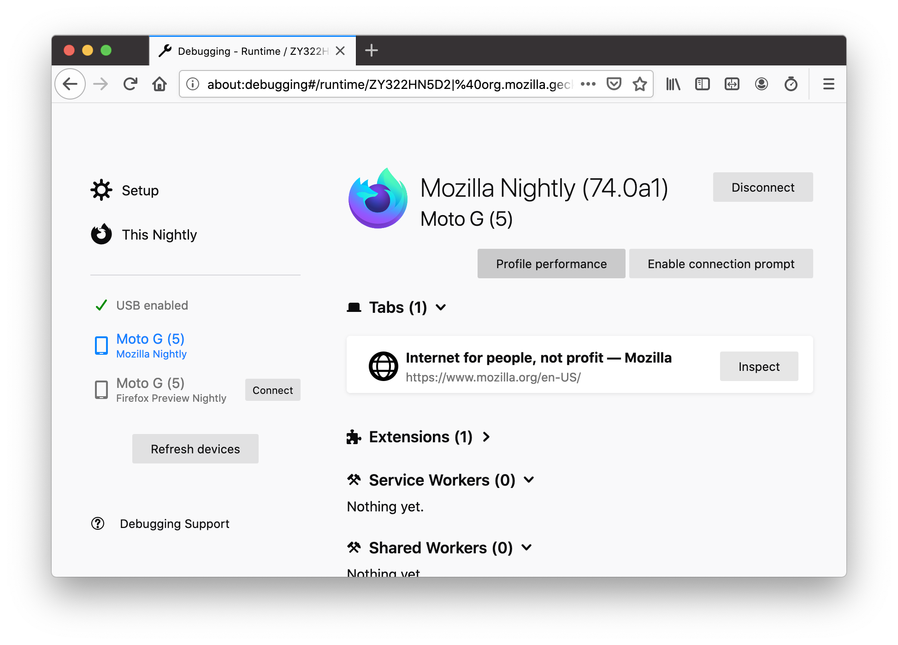
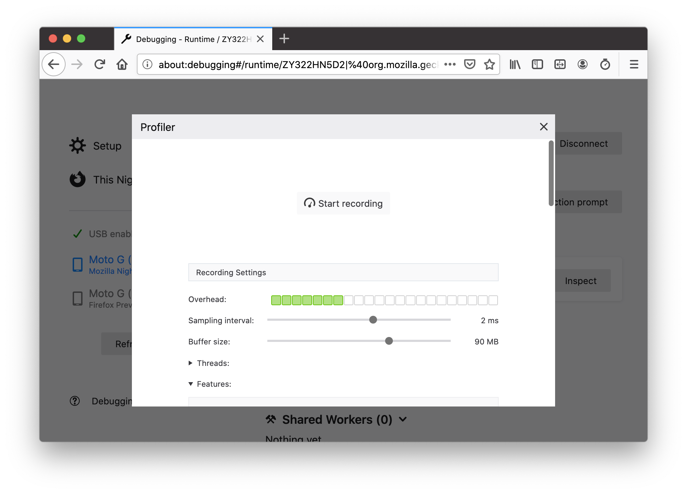

# Remote profiling on Android

You can use the Firefox Profiler to investigate performance issues on Android, not only Windows, macOS and Linux.

In order to do so, you need both your phone with the mobile Gecko-based browser, and a machine running Firefox Desktop. You also need a USB connection between the two devices. Then you can use [about:debugging](https://developer.mozilla.org/en-US/docs/Tools/about:debugging) in Firefox Desktop to connect to the phone and control profiling from there. The result will be shown in Firefox Desktop.

## Which mobile browser?

(The following is true as of August 2021.)

You probably want to profile [Firefox Nightly](https://play.google.com/store/apps/details?id=org.mozilla.fenix) from the Google Play Store. Read on for more details, or skip to the next section if you already know exactly which browser you want to profile.

Mozilla's current development efforts on mobile are focused on GeckoView and Firefox Preview (["Fenix"](https://github.com/mozilla-mobile/fenix)). You can [install Firefox Nightly from the Google Play Store](https://play.google.com/store/apps/details?id=org.mozilla.fenix), or you can download the APK ([32 bit](https://firefox-ci-tc.services.mozilla.com/api/index/v1/task/gecko.v2.mozilla-central.shippable.latest.mobile.android-arm-opt/artifacts/public/build/geckoview_example.apk), [64 bit](https://firefox-ci-tc.services.mozilla.com/api/index/v1/task/gecko.v2.mozilla-central.shippable.latest.mobile.android-aarch64-opt/artifacts/public/build/geckoview_example.apk)). Firefox Nightly is the preferred profiling target. It uses a [recent](https://github.com/mozilla-mobile/android-components/blob/master/buildSrc/src/main/java/Gecko.kt#L9) version of Gecko and updates frequently and automatically.

The other reasonable profiling target is something called ["GeckoView-example"](https://searchfox.org/mozilla-central/source/mobile/android/geckoview_example). This is a small Android app that isn't much more than a demo of GeckoView and doesn't have much UI. You can download the most recent GeckoView-example.apk ([32 bit](https://firefox-ci-tc.services.mozilla.com/api/index/v1/task/gecko.v2.mozilla-central.shippable.latest.mobile.android-api-16-opt/artifacts/public/build/geckoview_example.apk), [64 bit](https://firefox-ci-tc.services.mozilla.com/api/index/v1/task/gecko.v2.mozilla-central.shippable.latest.mobile.android-aarch64-opt/artifacts/public/build/geckoview_example.apk)) from TaskCluster, or you can compile Gecko yourself and [push Geckoview-example to the phone using `mach run`](https://firefox-source-docs.mozilla.org/mobile/android/geckoview/contributor/for-gecko-engineers.html#geckoview-example-app) or [using Android Studio](https://firefox-source-docs.mozilla.org/mobile/android/geckoview/contributor/geckoview-quick-start.html#build-using-android-studio). In fact, if you're working on Gecko, this is the most low-friction workflow if you want to quickly verify the performance impact of your changes on Android.

In general, profiling Fenix is preferable over profiling GeckoView-example because you'll be able to see impact from Fenix-specific performance issues. If you're compiling and modifying Gecko locally, you can create a version of Fenix that uses your custom Gecko [by making a small tweak to a `local.properties` file](https://firefox-source-docs.mozilla.org/mobile/android/geckoview/contributor/geckoview-quick-start.html#dependency-substiting-your-local-geckoview-into-a-mozilla-project) in your local clone of [the Fenix repository](https://github.com/mozilla-mobile/fenix).

You can also profile local builds or Try builds. This requires some extra steps which are described further down in this document.

## Setup

### Enable remote debugging on the mobile device

Your device needs to be connected to your computer before recording. You also need to have your Gecko-based Android app (such as Firefox Preview) running and set up for remote debugging via USB. This usually requires **two** settings:

 - Android itself needs to be configured to allow remote debugging over USB. This can be done in the system settings after entering "developer mode", which can be done by tapping on the Android build number repeatedly. See [the Android documentation](https://developer.android.com/studio/debug/dev-options.html) for details.
 - The app needs to be configured to allow remote debugging. There's usually a checkbox in the app's settings menu for that.

### Prepare `about:debugging`

To profile a Gecko Android build, you have to connect it to a Desktop Firefox browser. Please use [Firefox Nightly](https://www.mozilla.org/en-US/firefox/channel/desktop/#nightly) for this.

* Open the `about:debugging` page in Desktop Firefox by typing `about:debugging` in the URL bar, or via Tools > Web Developer > Remote Debugging.
* If necessary, click "Enable USB Devices".

## Recording

On `about:debugging`, find your device/browser in the sidebar on the left and connect to it. If your device is not listed, check the following things:

 - Is USB debugging enabled in the Android system preferences?
 - Is the browser you want to profile running? Try navigating to a page in order to make sure that Gecko has been initialized.
 - Is remote debugging enabled in the browser on the phone? If you've recently pushed a new version of this app to your phone, the settings from the previous version may have been lost, so you may need to enable the pref again.
 - Is your phone's screen unlocked?
 - Double-check your cable connections.
 - If you have `adb` on your Desktop machine, check if `adb devices` sees the phone. If not, try to fix that first.

Once you have connected to the phone browser successfully, read on.

Click the sidebar item for your phone / browser. Then, in the main section of the page, click the *Profile Performance* button.

Make any necessary adjustments in the presented options, like threads to sample or profiler features to enable, and then click *Start recording*. Perform the interactions you intend to profile on the Android device and then click *Capture Recording* in the Performance panel. A new tab will open in [https://profiler.firefox.com/](https://profiler.firefox.com/) with the collected profile ready for inspection.




## Symbols and symbol sources

If you've been profiling a browser from the Google Play Store, your profile should contain fully symbolicated C++ call stacks at least for libxul.so. If it doesn't, check the following:

 - Are you profiling a "Nightly" GeckoView build? A common mistake is to profile a regular "build" build from treeherder, i.e. one that was not compiled with the "nightly" configuration. Unfortunately, those regular treeherder builds do not upload symbol information to the Mozilla symbol server. Please use a different build in that case.
 - Are you profiling a build from the tryserver or a local build? Read on below for how to obtain symbol information in those cases.

### Try builds

If you want to profile an Android build that the tryserver created for you, you have to kick off a "Sym" job (run time: about 3 minutes) on treeherder: Using treeherder's *Add new jobs* UI, schedule a "Sym" job for each platform whose "B" job you want symbols for. (And "SymN" if you have an "N" job you want symbols for, i.e. a build job with the "nightly" configuration.) These jobs gather symbol information from the corresponding build job and upload it to the Mozilla symbol server so that the Firefox Profiler can use it.

### Local builds

If you've compiled an Android Gecko build locally, and want to profile it, you have to jump through one small extra hoop: Before profiling, in the *Profile Performance* panel in `about:debugging`, open the *Local build* section and add your Android build's objdir to the list. Then profile as usual, and you should be getting full symbol information. ... Except at the moment there is [a problem](https://bugzilla.mozilla.org/show_bug.cgi?id=1615066) that makes symbolication fail, unless you manually run a command to strip debug information from `libxul.so`. See the bug for more details.

## Startup profiling

For startup profiling, similar to [startup profiling on Desktop](https://developer.mozilla.org/en-US/docs/Mozilla/Performance/Profiling_with_the_Built-in_Profiler#Profiling_Firefox_Startup), you will need to manually set some `MOZ_PROFILER_STARTUP*` environment variables. The way to do this varies based on the app you want to profile (more details below). Once the app has been started with these environment variables, the profiler will be running. Then you can connect to the app using `about:debugging` as usual, and capture the profile with the regular UI.

### Startup profiling GeckoView-example (and Fennec)

If you have compiled GeckoView-example locally, you can launch it with `./mach run` and specify environment variables as follows:

```bash
./mach run --setenv MOZ_PROFILER_STARTUP=1 \
           --setenv MOZ_PROFILER_STARTUP_INTERVAL=5 \
           --setenv MOZ_PROFILER_STARTUP_FEATURES=threads,js,stackwalk,leaf,screenshots,ipcmessages,java \
           --setenv MOZ_PROFILER_STARTUP_FILTERS="GeckoMain,Compositor,Renderer,IPDL Background"
```

Alternatively, if you have installed GeckoView-example from another source, you can launch it from the command line using `adb` with environment variables specified like this:

```bash
adb shell am start -n org.mozilla.geckoview_example/.App \
    --es env0 MOZ_PROFILER_STARTUP=1 \
    --es env1 MOZ_PROFILER_STARTUP_INTERVAL=5 \
    --es env2 MOZ_PROFILER_STARTUP_FEATURES=threads,js,stackwalk,leaf,screenshots,ipcmessages,java \
    --es env3 MOZ_PROFILER_STARTUP_FILTERS="GeckoMain,Compositor,Renderer,IPDL Background"
```

### Startup profiling Fenix

Fenix has a [different way](https://firefox-source-docs.mozilla.org/mobile/android/geckoview/consumer/automation.html#reading-configuration-from-a-file) to specify environment variables: it uses a yaml file.

The easiest way to set up startup profiling is to run the `<fenix-repo>/tools/setup-startup-profiling.py` script. For example:
```bash
./tools/setup-startup-profiling.py activate nightly  # To activate startup profiling on nightly.
./tools/setup-startup-profiling.py deactivate beta  # To deactivate startup profiling on beta.
```

If the app is uninstalled or the device is restarted, the `activate` command may need to be re-run. The script is hard-coded to use a default configuration file with default profiling arguments. If you wish to change these arguments or use a non-standard app ID, modify the script locally or read below.

If you don't want to check out [the fenix repository](https://github.com/mozilla-mobile/fenix/), you should be able to download [the script standalone](https://raw.githubusercontent.com/mozilla-mobile/fenix/master/tools/setup-startup-profiling.py) and execute it.

#### Manual configuration

The filename of the YAML file mentioned above depends on the bundle ID of your Fenix app. The instructions below assume you want to profile the Fenix Nightly app, with the bundle ID `org.mozilla.fenix`.

 1. Create a file with the name `org.mozilla.fenix-geckoview-config.yaml` on your desktop machine and content of the following form:

    ```
    env:
      MOZ_PROFILER_STARTUP: 1
      MOZ_PROFILER_STARTUP_INTERVAL: 5
      MOZ_PROFILER_STARTUP_FEATURES: threads,js,stackwalk,leaf,screenshots,ipcmessages,java
      MOZ_PROFILER_STARTUP_FILTERS: GeckoMain,Compositor,Renderer,IPDL Background
    ```
 2. Push this file to the device with `adb push org.mozilla.fenix-geckoview-config.yaml /data/local/tmp/`.
 3. Run `adb shell am set-debug-app --persistent org.mozilla.fenix` to make sure the file is respected.

From now on, whenever you open the Fenix app, Gecko will be profiling itself automatically from the start, even if remote debugging is turned off. Then you can enable remote debugging, connect to the browser with `about:debugging`, and capture the profiling run.

You can delete the file again when you want to stop this behavior, e.g. using `adb shell rm /data/local/tmp/org.mozilla.fenix-geckoview-config.yaml`.

[Here's an example profile captured using this method](https://perfht.ml/3bKTFCG).

Refer to the [Reading configuration from a file](https://firefox-source-docs.mozilla.org/mobile/android/geckoview/consumer/automation.html#reading-configuration-from-a-file) section of the GeckoView docs for more details.

### Profiling App Link startup

Fenix can be launched with a URL as follows (assuming a debug Fenix build):

```
adb shell am start-activity -d "https://www.mozilla.org/" \
 -a android.intent.action.VIEW org.mozilla.fenix.debug/org.mozilla.fenix.IntentReceiverActivity
```

When combined with the startup profiling `.yaml` file as described in the previous section, this allows profiling GeckoView during the App Link startup path. This is the scenario of a user opening a link from a different Android app in the default browser.

Startup from App Link is the most important GeckoView startup scenario. In this scenario, GeckoView startup is directly in the critical path between the user action (tapping the link) and the first useful result (the web page being shown on the screen). This is different from the scenario of launching Fenix from the home screen - in that case, Fenix can show meaningful content even before Gecko is initialized, so Gecko's startup time is not as crucial to the experience.

## Tips

* Enable the "Screenshots" feature before profiling. Then you can see what's going on on the screen during your profiling run, which can be extremely helpful.
* Limit the duration of the profiling run. This will cut down on the profile size, which will reduce the time you have to wait when you click "Capture Profile". Smaller profiles are also less likely to crash the app due to memory limitations.
* Avoid clicking on any of the open tabs that are listed on the `about:debugging` page. Clicking on a tab will open a toolbox and add overhead by initializing content-side devtools code. For that reason, the profiling panel is separate from the toolbox.
* Choose a more relaxed profiling interval in order to reduce profiling overhead. 2ms to 5ms work well. This will give you less data but more accurate timings.
* To get maximally-realistic timings, consider using the "No Periodic Sampling" feature: This will cut down profiling overhead dramatically, but you won't have any stacks. If your workload is reproducible enough, you can take two profiles: one with stacks and one without. Then you can take your timings from the former and your information from the latter.
* Startup profiling reveals some overhead caused by devtools code that is only run when remote debugging is enabled. In order to see what startup does when remote debugging is turned off, you can deactivate remote debugging before you quit the app, and re-activate it after startup.
* If the recording doesn't start after clicking the start button, or if the button is inactive or in an otherwise confused state, it might be necessary to disconnect and reconnect to the phone to reset some state.
