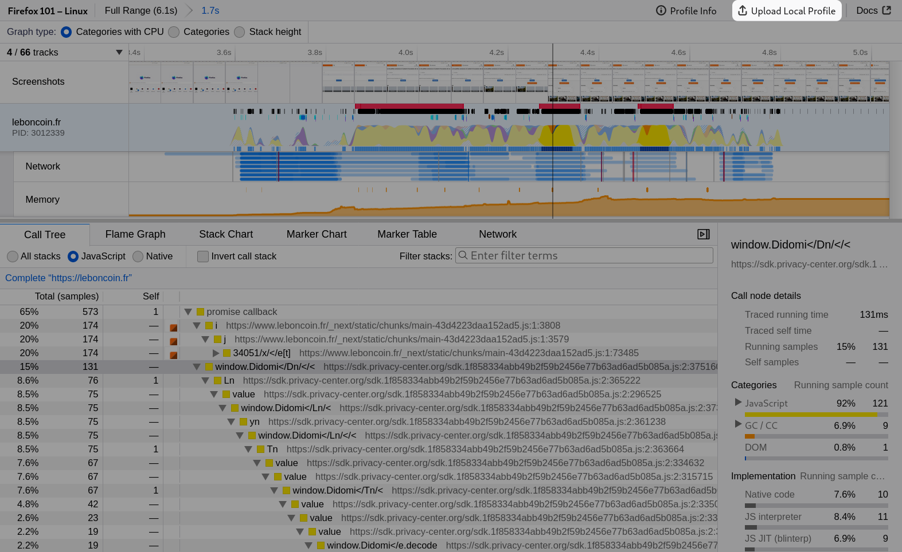
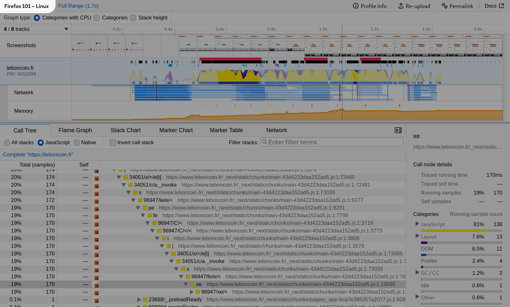

# UI Tour

Get to know Firefox Profiler UI a bit better with a tour that highlights various features. The screenshots are all taken from [this profile](https://share.firefox.dev/3rRG46l).

## Sharing profiles

One of the most powerful and useful features of the Firefox Profiler is the ability to upload and share profiles. The first step is to hit the *Upload Local Profile* button. You'll be able to exclude some information before uploading. Then the profile will be uploaded to an online storage. This profile can then be shared in online chat, emails, and bug reports. Note that anybody that has the link will be access the uploaded data, as it's not protected otherwise.

The current view and all of the filters applied to the profile will be encoded into the URL. After initially sharing the profile, a *Permalink* button will be added, that can then be used to provide a handy shortened URL to the current view.

It's possible to delete a previously uploaded profile from the [uploaded
recordings](https://profiler.firefox.com/uploaded-recordings/) page, or directly
from the profile viewer in the `Profile Info` dialog at the top of the window.

Profiles can also be saved to file, although the current view into the UI will not be saved. The file can be reloaded through the [profiler.firefox.com](https://profiler.firefox.com) interface by either drag and drop, or the file upload interface.

## Naming profiles

It's possible to name a profile so that it's conveniently findable later by
searching in the address bar. The name is part of the URL you'll share to others,
but otherwise isn't stored in the profile data.
