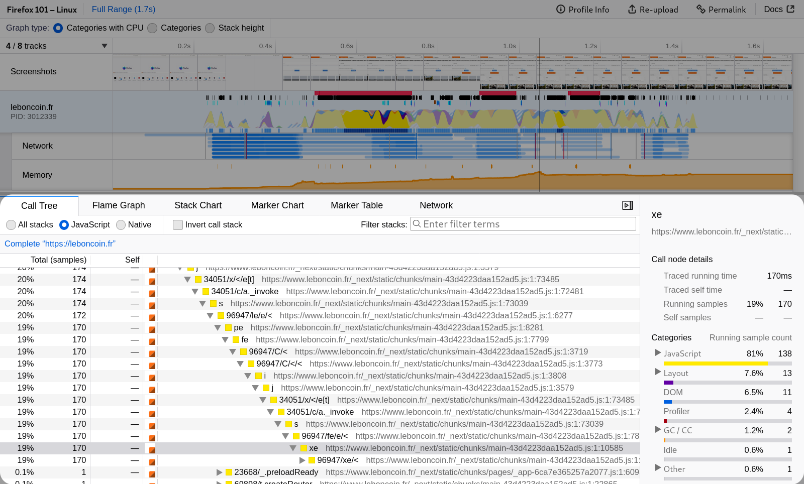
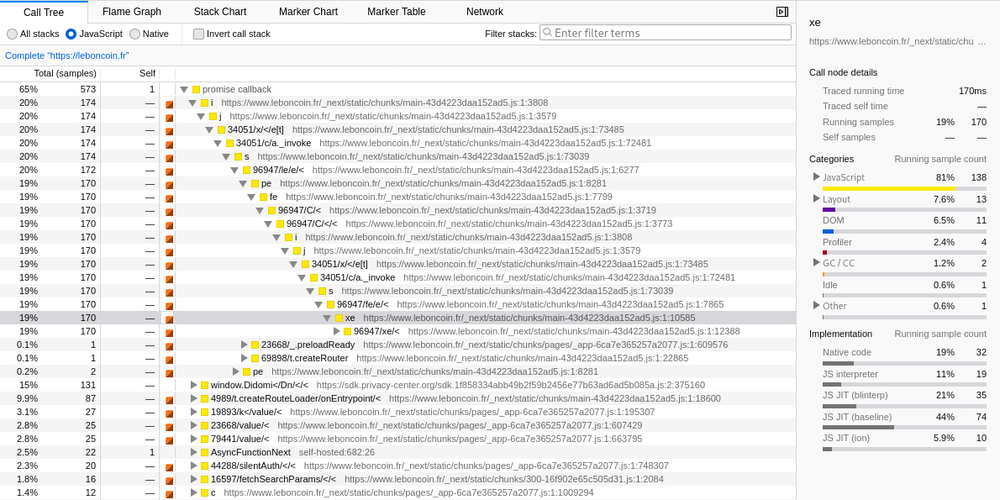
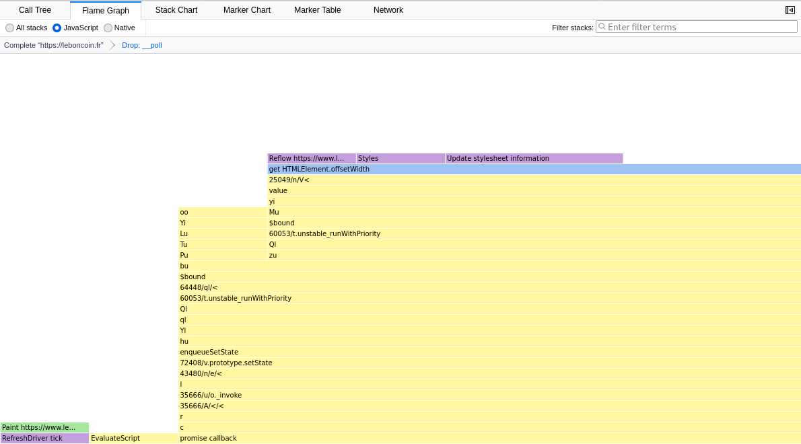
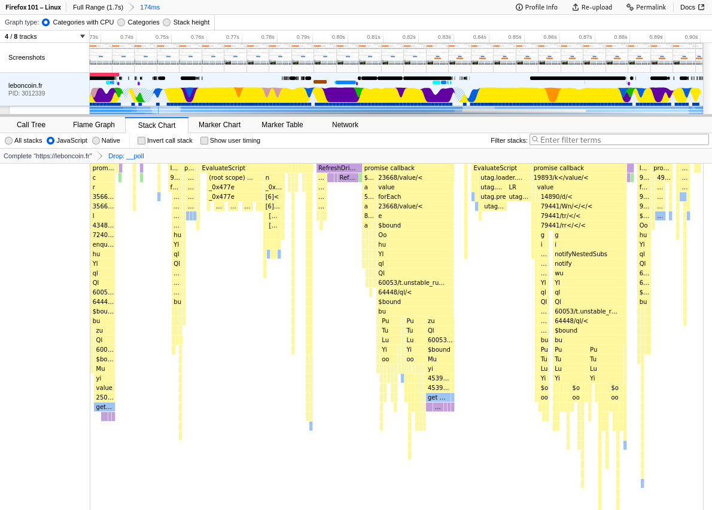
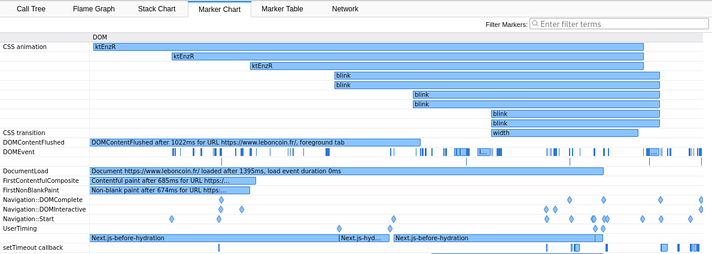
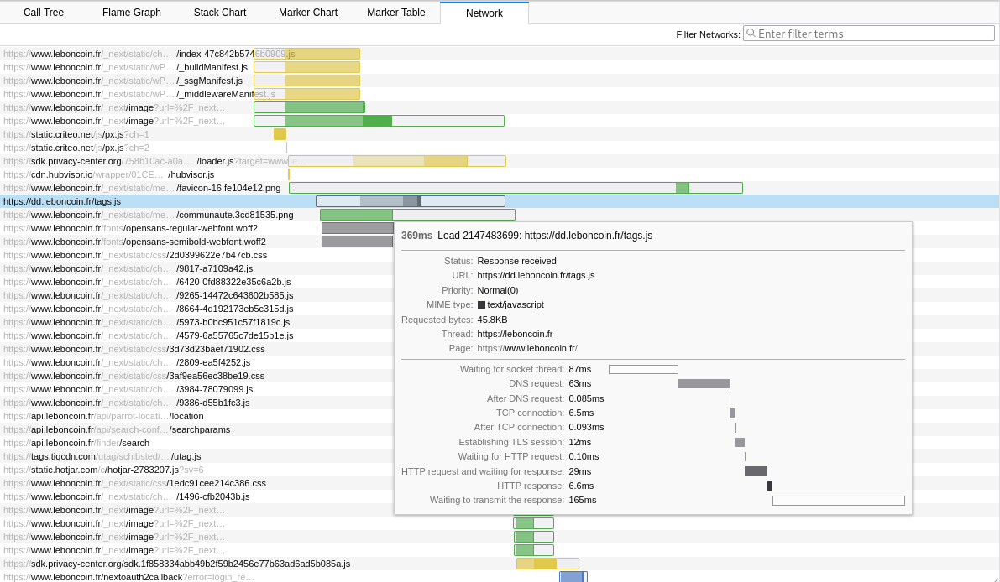

# UI Tour

Get to know Firefox Profiler UI a bit better with a tour that highlights various features. The screenshots are all taken from [this profile](https://share.firefox.dev/3rRG46l).

## The panels

The timeline lists multiple threads, while the panels provide an analysis of the currently selected thread in the timeline.
The panel only uses one thread at a time by default.
However, it's possible to merge several threads together by using the `⌘`/`Ctrl` keyboard key when clicking a thread.

## The Call Tree

The Call Tree panels is a synthetic view of the sample data. The page about
[stack samples and call trees](guide-stack-samples-and-call-trees) explains well
how the call tree structure is computed from the sample data.

In short, by merging the common ancestors in stacks, we can find out
which parts of the program run more often.

The [filtering guide](guide-filtering-call-trees) gives some useful information
about how to work with this view: searching, filtering to javascript,
transforming, and inverting (also called bottom-up tree).

Finally the sidebar gives a breakdown of the categories of the code running
inside the selected function.

## The Flame Graph

The Flame Graph provide a more visual view into the very same call tree
structures:

- Larger rectangles mean more running time.
- The rectangles at the top are the stacks contributing to the self time, that
  is the code where the program actually spends time.
- The order is always the same, which makes it more convenient to compare
  between different range selections, but also between different profiles.

Some users will prefer using the flame graph over the call tree because it's
much more visual.

## The Stack Chart

The Stack Chart panel also shows the sample data, but this isn't a summary.
Instead it's a chronological view that is aligned with the timeline: as we can
see on the screenshot above, the same categories can be seen at the same
timestamps. Therefore this provides a different view into the same data than the
previous panels.

Be careful though: in this panel we try to rebuild the sequence of the function calls,
but because the sample data by nature can miss short events, the view could show
a long call where it's instead a sequence of short calls.

## The Marker Chart

The Marker Chart is a chronological and visual representation of all markers
that happened during a profiling session. [As a reminder](./guide-profiler-fundamentals),
the marker data comes from source code instrumentation (C++, Rust, JavaScript,
Java).

By hovering on the markers it's possible to inspect their data. For example for
CSS animation markers, the element that the animation runs for is displayed.

Right clicking on a marker displays a context menu that allows interacting even
more with these pieces of information, such as copy their data.

Web Developers can add their own markers using [performance.mark](https://developer.mozilla.org/en-US/docs/Web/API/Performance/mark) and
[performance.measure](https://developer.mozilla.org/en-US/docs/Web/API/Performance/measure). Gecko Developers can look at [this comprehensive
documentation](https://firefox-source-docs.mozilla.org/tools/profiler/markers-guide.html) to add their new markers.

Markers can be filtered with a comma-separated list of search terms. Each term
can be a substring to match, `key:substring` to match more specifically,
or `-key:substring` to drop anything matching. (`-substring` will not work;
negative matches require a `key`.) Valid `key` values are: `name`, `cat` (for
marker category), `type` (for markers with payload objects), and any marker
payload field key declared in the marker's schema.

Example: `DOM,cat:GC,-name:CSS` will match anything with DOM in its category,
name, type, or any field, plus anything with "GC" in its category,
but omitting markers with "CSS" anywhere in their names.

## The Marker Table

This panel provide a table view to the same data as the marker chart. Its
strength is that by searching it's possibly faster to display the payload
information for several markers at once.

Filtering works the same as in the Marker Chart.

## The Network Chart

This panel shows all network requests happening during the capturing session.
Especially all the phases happening during a request are shown, and they are
even more detailed when hovering a line.

This panel is also chronologically aligned with the timeline, so that we can
relate network requests with it.

The network requests are also displayed in the marker chart as well as the
timeline.
