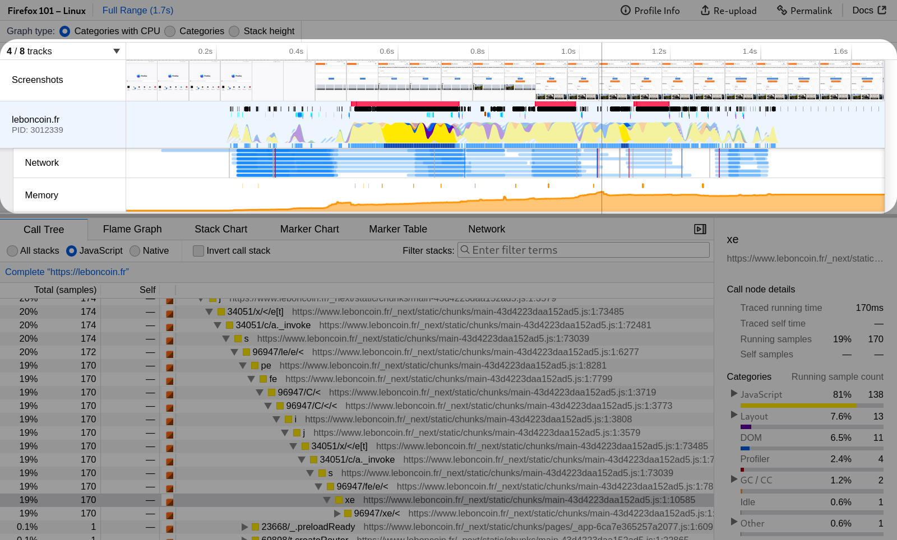
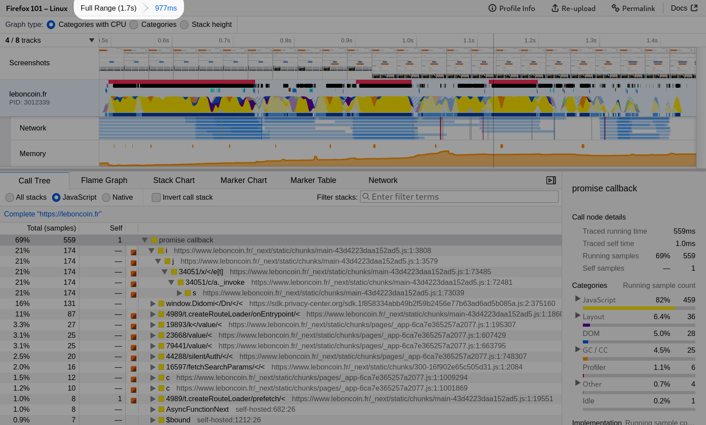
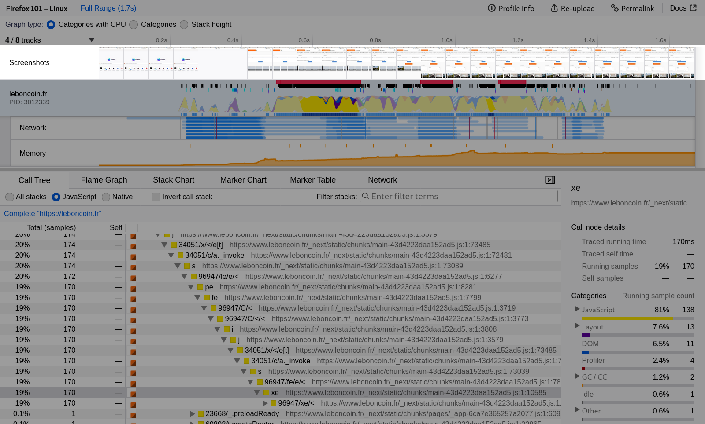
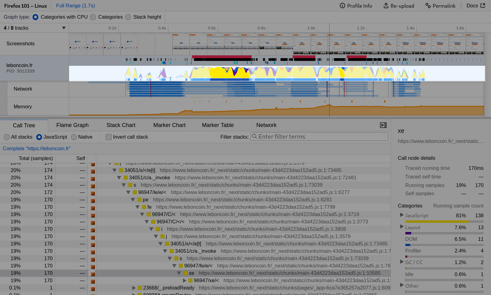
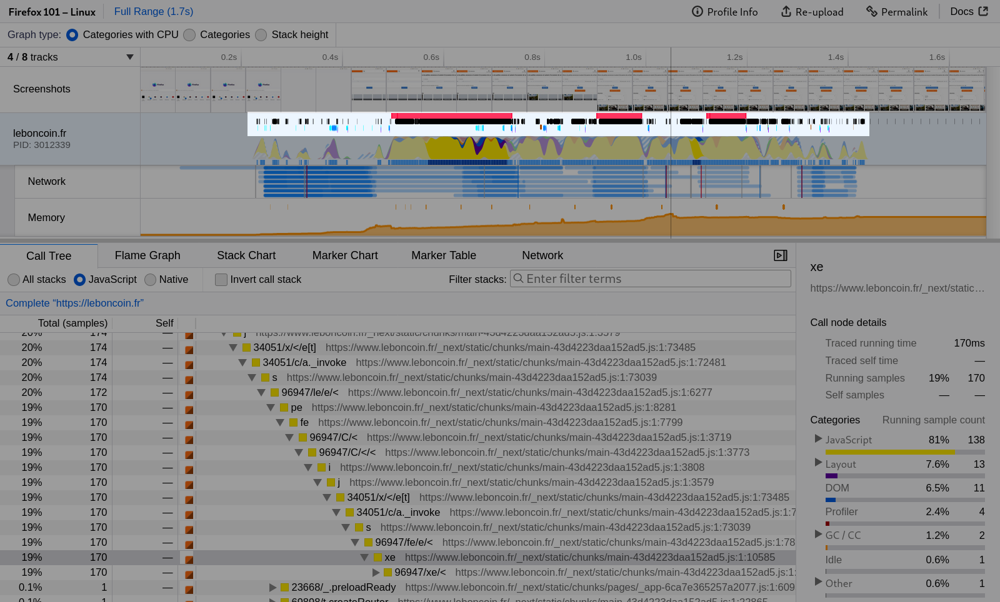
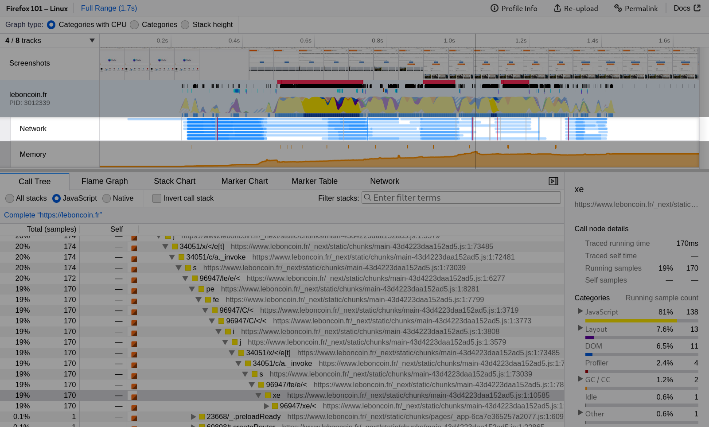
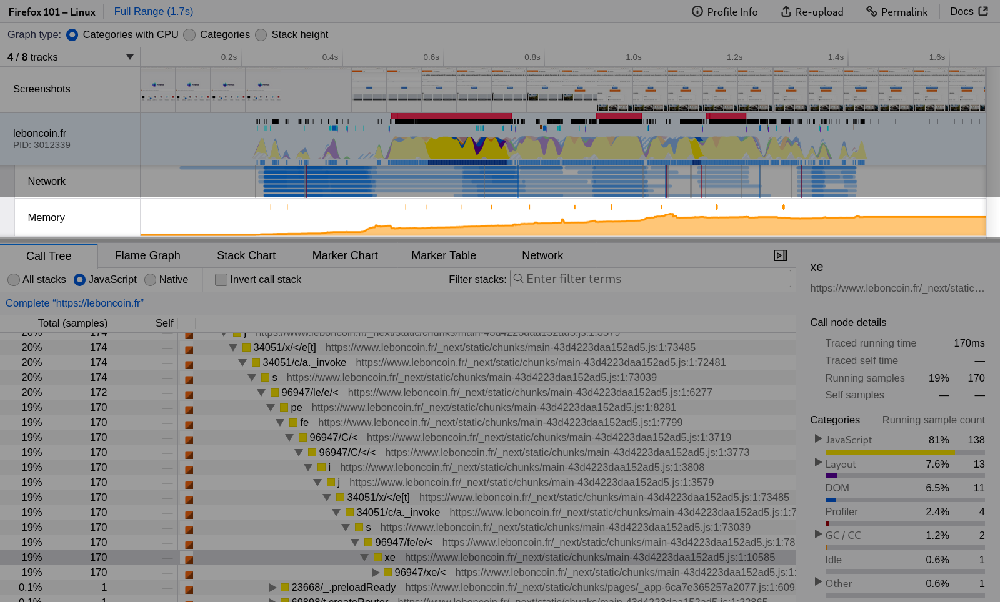
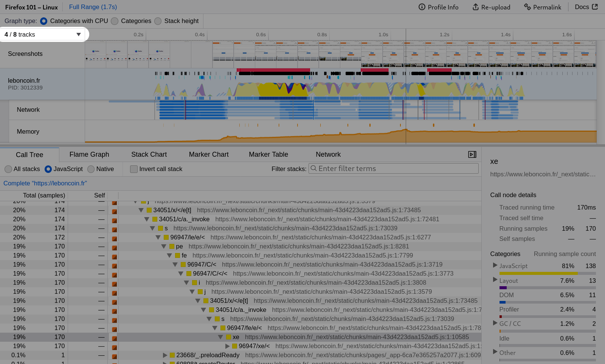

# UI Tour

Get to know Firefox Profiler UI a bit better with a tour that highlights various features. The screenshots are all taken from [this profile](https://share.firefox.dev/3rRG46l).

## Timeline

The Firefox Profiler visualizes multi-threaded profiles. Each thread gets a row in the timeline. Clicking on the name of the thread selects the thread for the selected panel below the timeline. Threads can be hidden and shown by right clicking the thread name.

## Creating a range selection

[A video highlighting a range selection in the timeline.](images/ui-tour-selection.webm ':include :type=video controls width=100%')

Clicking and dragging in the timeline creates a new range selection. The selection is used to zoom in on information in the panels below. For example, the call tree recomputes dynamically when dragging across the timeline. These range selections can be committed by clicking the zoom button.

## The committed range selections

Committing a range selection by clicking the zoom button is a useful way to zoom in on a useful selection. It can be helpful to commit several ranges to focus on specific parts of a profile.

## The timeline's screenshots

The screenshots track helps users navigate through the profile by providing visual context within the timeline.

## Timeline's activity graph

Each thread in the timeline contains an activity graph. The X axis represents time, and the Y axis represents the CPU usage.

Clicking on the activity graph will select a sample and update the panel below (if the panel uses the currently selected stack). For instance, in the call tree, it will open up the tree to find the stack for this sample. The selected stack will be colored a darker blue in the list. This is another useful way to correlate stacks with when they were executed over time.

[Stacks and samples can be filtered out](./guide-filtering-call-trees.md) through various operations. When this happens, the activity graph will be greyed at that spot. When the thread didn't have samples at all for an area (for instance the thread hadn't yet started up), then it should have an indicator as to the reason why there are no samples.

## Timeline's markers

Markers are displayed in the timeline and can be useful to correlate events with the activity graph. Markers can be clicked to set the range selection to that time. Hovering over the marker will display a tooltip with information about the marker.

Perhaps one of the most useful markers is the responsiveness marker—pictured here in red. This is collected when events are taking a long time to run inside of Firefox. Clicking on one of these will quickly zoom in on potential problem areas and can indicate jank.

Only certain markers are broken out and colored in the timeline. A similar but more detailed view can be seen in the Marker Chart panel.

## Timeline's network activity

Network requests are displayed in the timeline, which can be useful to correlate
the work that's done by the browser and the webpage, and the network activity.
For example you could find out that some JavaScript code is executed when
some response is received.

Hovering a network request will show interesting information about it, and
clicking it will switch to the more detailed network panel.

## Timeline's memory usage change

The timeline also gives an overview of the memory usage change for a process.
Please note that this doesn't show the absolute memory usage, but rather the
difference between the lowest and highest memory usage during the profiling
session.

## Track selection

With the button right above the tracks it's possible to either hide tracks and
threads that are in the way when analyzing a profile, or show some that were
automatically hidden when loading the profile because we thought they were less
interesting.

The same operations can be carried out with a right click on each track.
