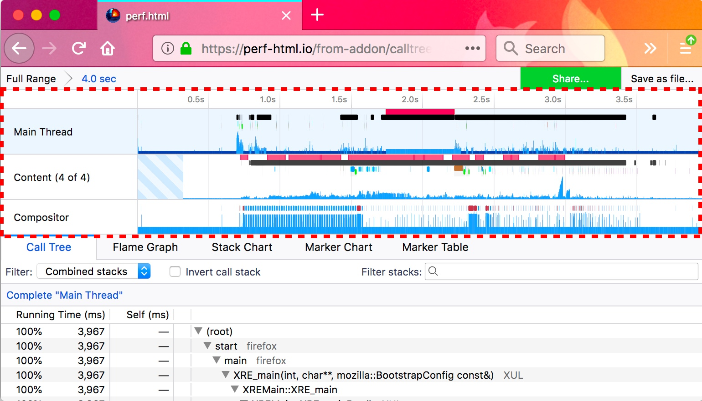
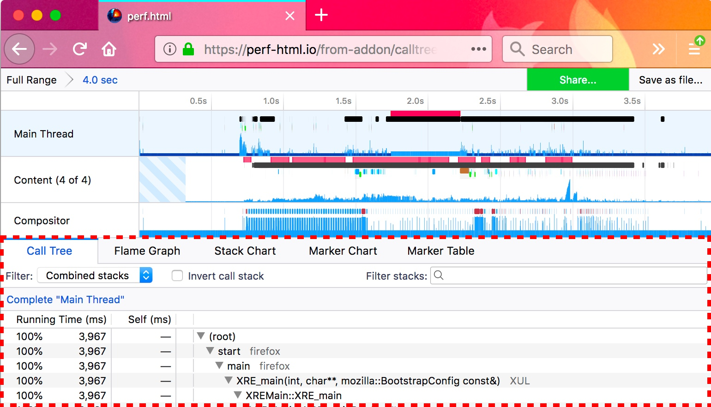
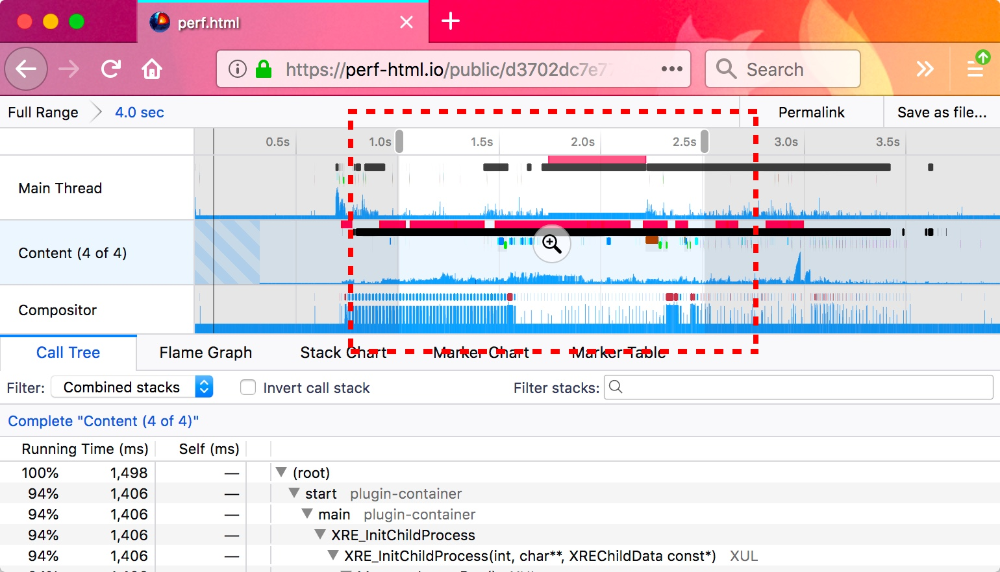
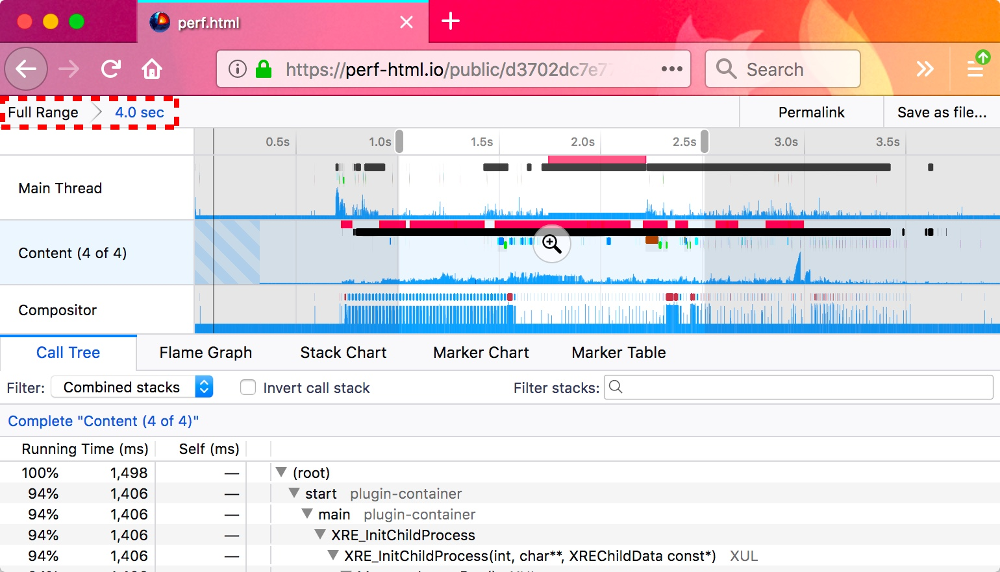
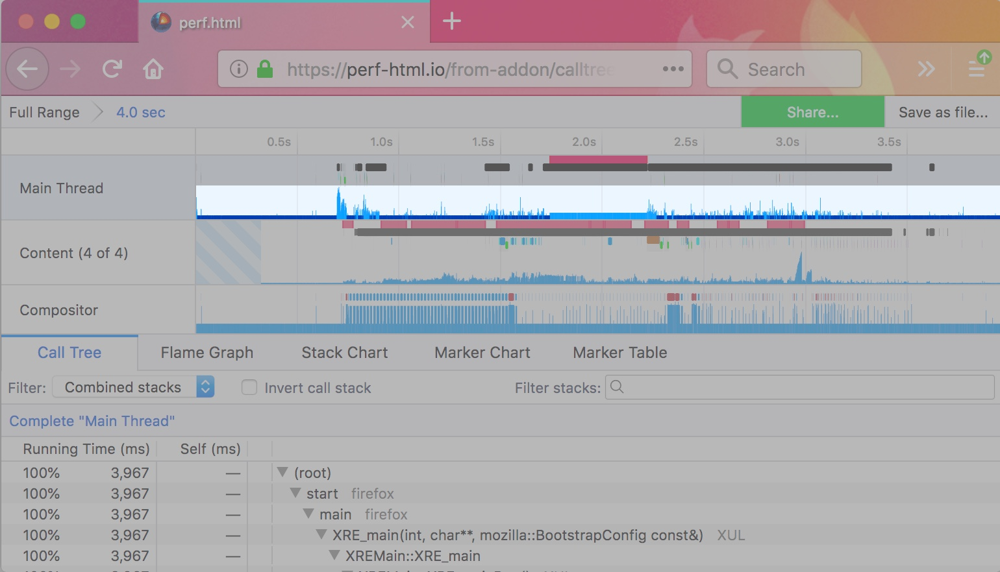
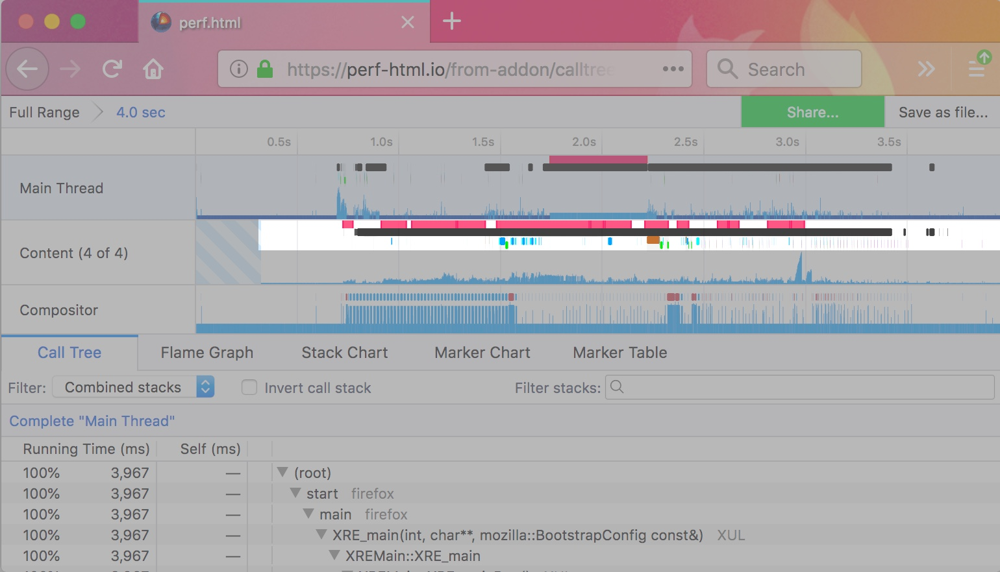
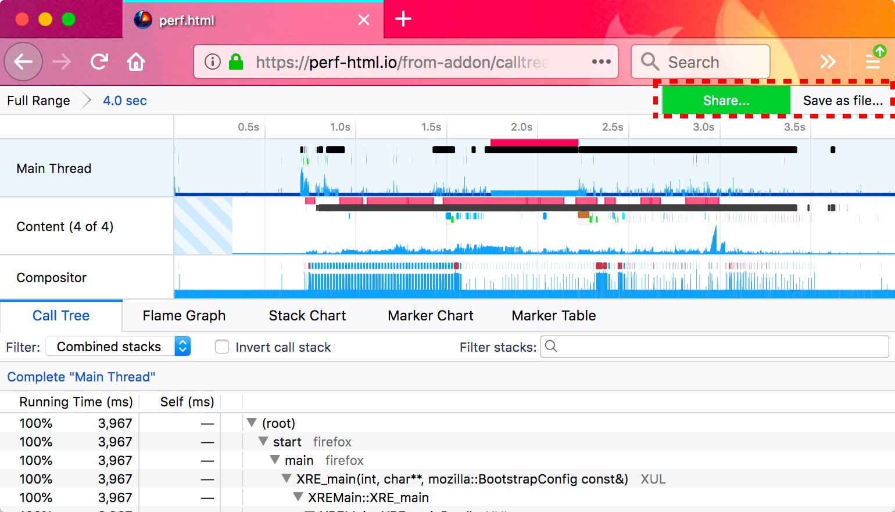

# UI Tour

Get to know perf.html UI a bit better with a tour that highlights various features. The screenshots are all taken from [this profile](https://perfht.ml/2GsIL3E).

## Timeline

perf.html visualizes multi-threaded profiles. Each thread gets a row in the timeline. Clicking on the name of the thread selects the thread for the selected panel below the timeline. Threads can be hidden and shown by right clicking the thread name.

## The panels

The timeline lists multiple threads, while the panels provide an analysis of the currently selected thread in the timeline. The panel only uses one thread at a time.

## Creating a range selection

Clicking and dragging in the timeline creates a new range selection. The selection is used to zoom in on information in the panels below. For example, the call tree recomputes dynamically when dragging across the timeline. These range selections can be committed by clicking the zoom button.

## The committed range selections

Committing a range selection by clicking the zoom button is a useful way to zoom in on a useful selection. It can be helpful to commit several ranges to hone in on specific parts of a profile.

## Timeline's thread stack graph

Each thread in the timeline contains a thread stack graph. The X axis represents time, and the Y axis represents the height of the stack. It's important to realize that the height does not correlate with the amount of work that was being done. It only represents the arbitrary height of the stack at the time. It can be used as a useful way to get oriented with what was executing at the time.

Clicking on the thread stack graph will select that stack and update the panel below (if the panel uses the currently selected stack). For instance, in the call tree, it will open up the tree to find the stack. The selected stack will be colored a darker blue in the list. This is another useful way to correlate stacks with when they were executed over time.

[Stacks and samples can be filtered out ](./guide-filtering-call-trees.md) through various operations. When this happens, the thread stack graph will be empty at that spot. When the thread didn't have samples at all for an area (for instance the thread hadn't yet started up), then it should have an indicator as to the reason why there are no samples.

## Timeline's markers

Markers are displayed in the timeline and can be useful to correlate events with the thread stack graph. Markers can be clicked to set the range selection to that time. Hovering over the marker will display a tooltip with information about the marker.

Perhaps one of the most useful markers is the responsiveness marker—pictured here in red. This is collected when events are taking a long time to run inside of Firefox. Clicking on one of these will quickly hone in on potential problem areas and can indicate jank.

Only certain markers are broken out and colored in the timeline. A similar but more detailed view can be seen in the Marker Chart panel.

## Sharing profiles

One of the most powerful and useful features of perf.html is the ability to save and share profiles. The first step is to hit the *Share...* button. After accepting the privacy prompt, the profile will be uploaded to online storage. This profile can then be shared in online chat, emails, and bug reports.

The current view and all of the filters applied to the profile will be encoded into the URL. After initially sharing the profile, the *Share...* button will change into a *Permalink* button that can then be used to provide a handy shortened URL to the current view.

Profiles can also be saved to file, although the current view into the UI will not be saved. The file can be reloaded through the [perf-html.io](https://perf-html.io) interface by either drag and drop, or the file upload interface.
