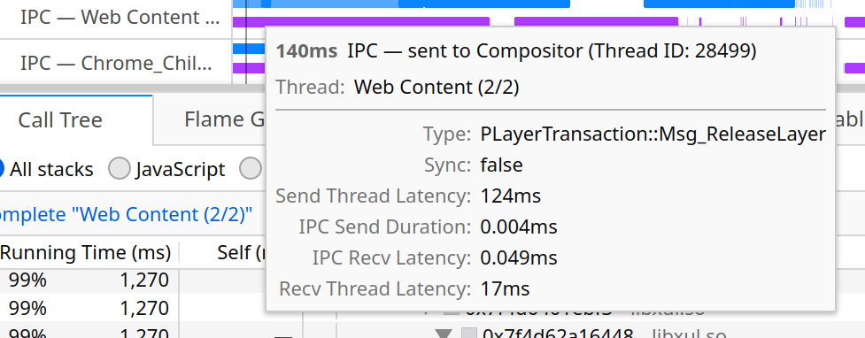
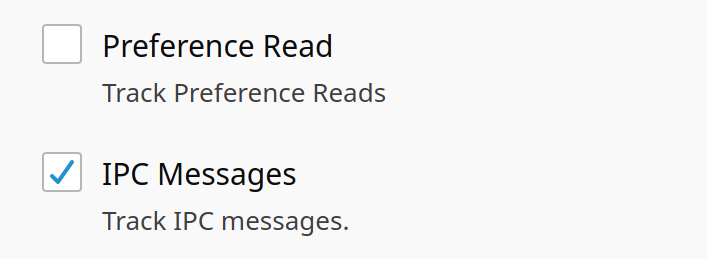
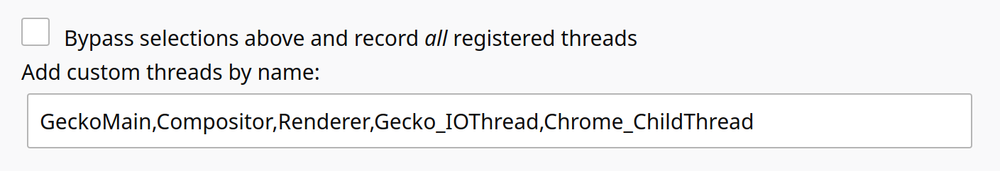

# IPC Messages

The Firefox Profiler supports recording IPC messages for any actively-profiled
thread. During profiling, each IPC message is recorded with 5 events:

1. When the `SendXXX` function is called on the origin thread
2. When the sender's IO thread begins sending bytes over the IPC channel
3. When the sender's IO thread finishes sending bytes over the IPC channel
4. When the recipient's IO thread finishes receiving bytes from the IPC channel
5. When the `RecvXXX` function is called on the destination thread

## IPC Track

After collecting a profile with IPC messages, there will be a new track in the
timeline showing the outgoing (blue) and incoming (purple) IPC messages.
Hovering over a marker for an IPC message will provide more details about it:

Each IPC message has several durations associated with it, corresponding to the
spans of time between consecutive IPC message phases as described above:

- _Send thread latency_: the time between `SendXXX` being called and the first
  byte sent over the IPC channel
- _IPC send duration_: the time taken to send all the bytes over the IPC channel
- _IPC recv latency_: the time between the last byte being sent over the IPC
  channel and the last byte being _received_
- _Recv thread latency_: the time between the last byte being received from the
  IPC channel and the `RecvXXX` function being called

## Enabling the Feature

In `about:profiling`, scroll down to the `Features` section and enable the
`IPC Messages` checkbox.

### Profiling the IO Threads

By default, the sender's and recipient's IO threads aren't included in a
profile. To include these, add `Gecko_IOThread` and `Chrome_ChildThread` to the
list of threads to be profiled.

