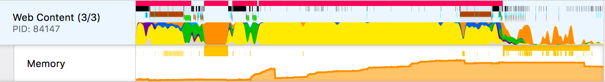
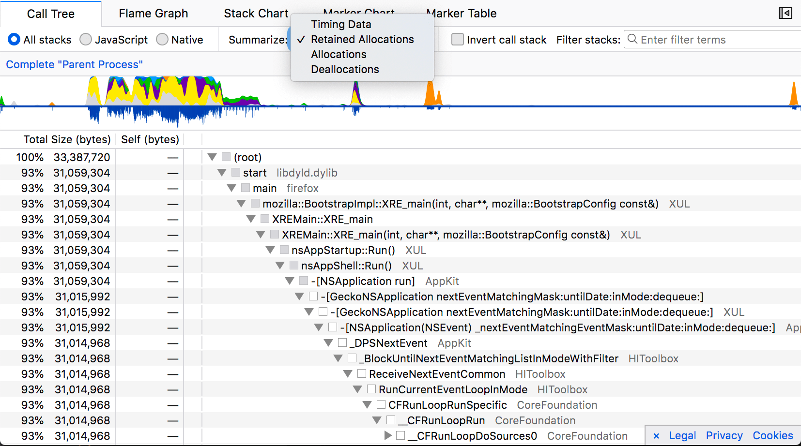
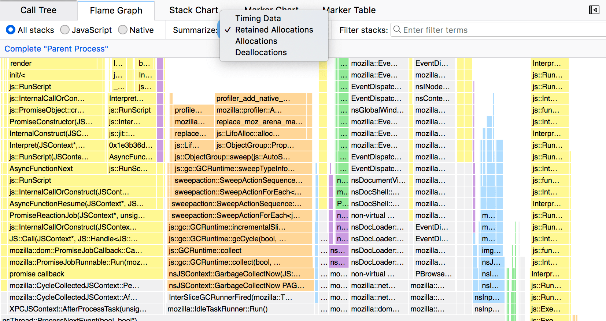
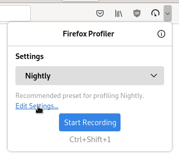
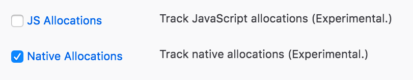
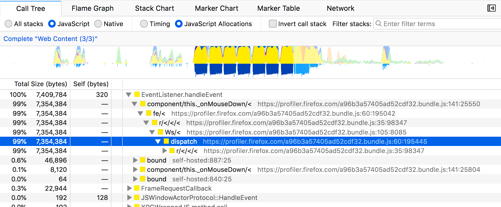

# Memory Allocations

The Firefox Profiler supports different types of memory profiling

1. Memory Track
2. Native Allocations
3. JavaScript Allocations
4. Valgrind DHAT Profiles

## Memory Track



The memory track graphs overall allocation and deallocation numbers over time for a single process. It is enabled only in Nightly. It works by tracking every allocation and deallocation, and occasionally sampling what that summed number is. The track also collects the markers related to garbage collection and cycle collection. Mouse over the graph to see all of the numbers.

The graph visualization tracks the relative memory usage over the committed range of time. It's important to note that this is not absolute memory usage. The graph and numbers will change when committing a range selection.

## Native Memory Allocations

The profiler has support for analyzing allocations in native code (C++ and Rust) via stack sampling. These features require Nightly. To follow along you can open this [example showing DevTools opening and closing](https://perfht.ml/2LKZsfY)

The Native Allocations feature works by collecting the stack and size of memory allocations from native (C++ or Rust) code. It does not collect every allocation, but only samples a subset of them. The sampling is biased towards larger allocations and larger frees. Larger allocations are more likely show up in the profile, and will most likely be more representative of the actual memory usage. Keep in mind that since these allocations are only sampled, not all allocations will be recorded. This means that memory track (the orange graph at the top) will most likely report different numbers for memory usage.

Please note that this feature has a lot of overhead, therefore the timing data
will be more skewed that usual. Don't pay too much attention to this data if a
profile contains native allocations data.

### Allocations in various panels

The allocations can be viewed in the call tree, and flame graph, but not the stack chart.





### Enable the Feature

1. Open Nightly.
2. Click on the `Profiler Icon` to open the `Profiler Popup`. If it's not
   present, you can add it first by visiting https://profiler.firefox.com.
3. Click on `Edit Settings`.
4. Under Features, enable the `Native Allocations` checkbox. This will enable the feature.
5. Record a profile.





### Native allocation summary strategies

#### Summarize Retained allocations

In the profiler, the allocations are sampled, but de-allocations are matched against the sampled allocations. This means that the profiler can tell which allocations were retained, and which were not in a given time frame. In the UI, drag an interactive range selection to update which allocations were retained within the view. This can be helpful to identify potential memory leaks. For instance in [this profile of DevTools opening and closing](https://perfht.ml/2LKZsfY) you can create a range selection and scrub through the different parts of the profile. Ideally, after the window is closed, most of the allocations should be removed.

#### Summarize Allocations

This option in the dropdown shows all allocations that were sampled, regardless if they were deallocated.

#### Summarize Deallocations

This option shows all of the deallocations that were sampled. Keep in mind that this view will only show the deallocations for allocations that were tracked by the profiler. These deallocations are not independently sampled.

### Limitations in native allocation tracking

Some components inside of Gecko may implement their own memory management systems, and bypass the usage of system-level functions like `malloc` that are instrumented with this feature. For instance, some code could create a large buffer, and manage its own memory inside of that buffer. This feature would know about the allocation of the larger chunk of memory, but not how smaller allocations could be created inside of that buffer of memory. If this happens, information could be missing or misleading.

## JavaScript Allocations

There is also a JavaScript-only allocation feature. This may be less useful as it only samples the creation of JS objects, and does not track garbage collection or frees. In fact, the Native Allocations feature is a superset of the JavaScript allocations feature, and includes the JavaScript stack information. Enable this through the `Features` section of the popup.



## Valgrind's "Dynamic Heap Analysis Tool" DHAT

When working outside of Firefox, you can use [Valgrind's DHAT tool](https://valgrind.org/docs/manual/dh-manual.html). DHAT has its own viewer, but it lacks some of the visualization and filtering capabilities of the Firefox Profiler. The converted profile will lack some of the finer details like read, write, and access information, but it does contain the amount of bytes allocated. On a Linux system (or even a Linux docker image), you can install it via:

```sh
sudo apt-get install valgrind
```

Then run your command:

```
valgrind --tool=dhat ./my-program
```

A dhat profile will be output in the same directory as your program: `dhat.out.<pid>`. Drag that file into the profiler to view it. There will be 4 tracks containing the memory information. Only the call tree and flame graph are supported.

- **Bytes at End** - Allocations that were never freed when the program ended.
- **Bytes at Global Max** - Bytes allocated when the global heap size peaked.
- **Maximum Bytes** - The maximum bytes allocated at that call site at one time.
- **Total Bytes** - The total bytes allocated over the course of the program.
