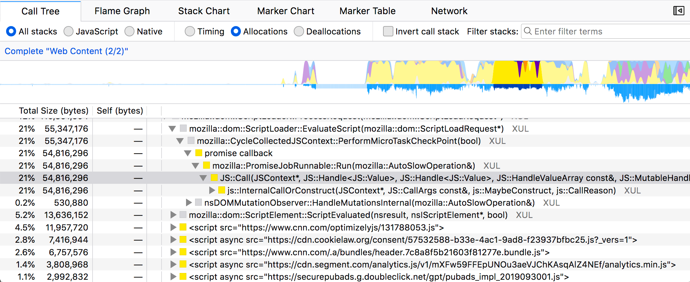
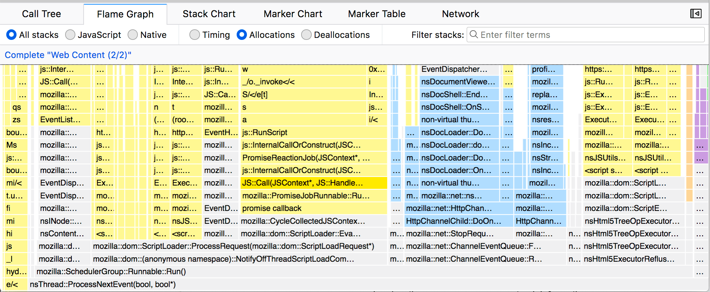

# Memory Allocations

The Firefox Profiler supports three different types of memory profiling

1. Memory Track
2. Native Allocations (experimental)
3. JavaScript Allocations (experimental)

## Memory Track

The memory track graphs overall allocation and deallocation numbers over time for a single process. It is enabled only in Nightly. It works by tracking every allocation and deallocation, and occasionally sampling what that summed number is. The track also collects the markers related to gargage collection and cycle collection. Mouse over the the graph to see all of the numbers.

The graph visualization tracks the relative memory usage over the committed range of time. It's important to note that this is not absolute memory usage. The graph and numbers will change when committing a range selection.

## Native Memory Allocations (experimental)

The profiler has experimental support for analyzing allocations in native code (C++ and Rust) via stack sampling. These features require Nightly and the new Profiler Toolbar Icon (directions below).

The Native Allocations feature works by collecting the stack and size of memory allocations from native (C++ or Rust) code. It does not collect every allocation, but only samples a subset of them. The sampling is biased towards larger allocations and larger frees. Larger allocations are more likely show up in the profile, and will most likely be more representative of the actual memory usage. Keep in mind that since these allocations are only sampled, not all allocations will be recorded. This means that memory track (the orange graph at the top) will most likely report different numbers for memory usage.

### Allocations in various panels

The allocations can be viewed in the call tree, and flame graph, but not the stack chart.

### Enable the Feature

1. Open Nightly.
2. Enable the Profiler Toolbar Icon via through the menu via: `Tools -> Web Developer -> Enable Profiler Toolbar Icon`.
3. Click on the `Profiler Toolbar Icon` to open the `Profiler Popup`.
4. Under Features, enable the `Native Allocations` checkbox. This will enable the feature.
5. Record a profile.

### Limitations in Native Allocation Tracking

#### Limitation: Allocations tracked per-thread

The allocations and deallocations are reported per thread. This means that one thread can allocate memory, and another could free it. In addition, the memory track (the orange line graph in the header) reports per *process*, which means that the line graph may not match the numbers in the call tree.

### Limitation: Allocations and deallocations are sampled separately

The native allocations feature samples allocations, and it samples deallocations in a different step. This means that we can sample a large allocation that may not be sampled when it gets freed. This means the call tree could potentially give misleading results if the deallocations were subtracted from the allocations.

Note: [Bug 1582741](https://bugzilla.mozilla.org/show_bug.cgi?id=1582741) tracks a feature to provide balanced allocations and frees.

## JavaScript Allocations (experimental)

There is also a JavaScript-only allocation feature. This may be less useful as it only samples the creation of JS objects, and does not track garbage collection or frees. In fact, the Native Allocations feature is a superset of the JavaScript allocations feature, and includes the JavaScript stack information. Enable this through the `Features` section of the popup.

