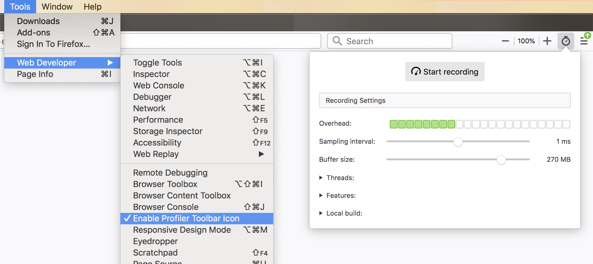

# Memory Allocations

The Firefox Profiler supports three different types of memory profiling

1. Memory Track
2. Native Allocations (experimental)
3. JavaScript Allocations (experimental)

## Memory Track

The memory track graphs overall allocation and deallocation numbers over time for a single process. It is enabled only in Nightly. It works by tracking every allocation and deallocation, and occasionally sampling what that summed number is. The track also collects the markers related to garbage collection and cycle collection. Mouse over the graph to see all of the numbers.

The graph visualization tracks the relative memory usage over the committed range of time. It's important to note that this is not absolute memory usage. The graph and numbers will change when committing a range selection.

## Native Memory Allocations (experimental)

The profiler has experimental support for analyzing allocations in native code (C++ and Rust) via stack sampling. These features require Nightly and the new Profiler Toolbar Icon (directions below). To follow along you can open this [example showing DevTools opening and closing](https://perfht.ml/2LKZsfY)

The Native Allocations feature works by collecting the stack and size of memory allocations from native (C++ or Rust) code. It does not collect every allocation, but only samples a subset of them. The sampling is biased towards larger allocations and larger frees. Larger allocations are more likely show up in the profile, and will most likely be more representative of the actual memory usage. Keep in mind that since these allocations are only sampled, not all allocations will be recorded. This means that memory track (the orange graph at the top) will most likely report different numbers for memory usage.

### Allocations in various panels

The allocations can be viewed in the call tree, and flame graph, but not the stack chart.

### Enable the Feature

1. Open Nightly.
2. Enable the Profiler Toolbar Icon via through the menu via: `Tools -> Web Developer -> Enable Profiler Toolbar Icon`.
3. Click on the `Profiler Toolbar Icon` to open the `Profiler Popup`.
4. Under Features, enable the `Native Allocations` checkbox. This will enable the feature.
5. Record a profile.

### Native allocation summary strategies

#### Summarize Retained allocations

In the profiler, the allocations are sampled, but de-allocations are matched against the sampled allocations. This means that the profiler can tell which allocations were retained, and which were not in a given time frame. In the UI, drag an interactive range selection to update which allocations were retained within the view. This can be helpful to identify potential memory leaks. For instance in [this profile of DevTools opening and closing](https://perfht.ml/2LKZsfY) you can create a range selection and scrub through the different parts of the profile. Ideally, after the window is closed, most of the allocations should be removed.

#### Summarize Allocations

This option in the dropdown shows all allocations that were sampled, regardless if they were deallocated.

#### Summarize Deallocations

This option shows all of the deallocations that were sampled. Keep in mind that this view will only show the deallocations for allocations that were tracked by the profiler. These deallocations are not independently sampled.

### Limitations in native allocation tracking

Some components inside of Gecko may implement their own memory management systems, and bypass the usage of system-level functions like `malloc` that are instrumented with this feature. For instance, some code could create a large buffer, and manage its own memory inside of that buffer. This feature would know about the allocation of the larger chunk of memory, but not how smaller allocations could be created inside of that buffer of memory. If this happens, information could be missing or misleading.

## JavaScript Allocations (experimental)

There is also a JavaScript-only allocation feature. This may be less useful as it only samples the creation of JS objects, and does not track garbage collection or frees. In fact, the Native Allocations feature is a superset of the JavaScript allocations feature, and includes the JavaScript stack information. Enable this through the `Features` section of the popup.

